## Overview
This was a fun OSINT CTF organized and hosted by the great team over at [OSINT Switzerland](https://osintswitzerland.ch/). Contestants were given 30 hours to complete a multitude of OSINT challenges and could sign up solo or with a partner.

This was my first OSINT CTF and I found out about it last minute, so I went about it solo. I'll be covering my solutions, thought process and some retrospect on the challenges. There are plenty of spoilers ahead, but all the context you need for (most) challenges is at the start of their respective sections, so if you want to try them before looking at my solutions please do!

**DISCLAIMER**: These challenges were made for educational purposes **only** and should not be used for malicious purposes.

## Challenges
### Introduction
---
>Your entry flag, brave investigator, is the key into the Realm of the Pumpkin… 🎃🔑 🎃🎃🎃 hpCTF{Th4nk5_4_F0ll0w1ng_Th3_Ru135} 🎃🎃🎃

Starting off difficult, we're tasked with the ultimate challenge: reading. Jokes aside, this flag was used as a rule agreement, and could be found at the end of the text.


hpCTF{Th4nk5_4_F0ll0w1ng_Th3_Ru135}


---

### Horror Clowns
---
>A few years ago, there were some people dressing up as Horror Clowns, showing up out of nowhere scaring the hell out of people as can be seen in the following staged video. Link: https://www.youtube.com/watch?v=vaXjN3zChyE
>
>Can you find the name of the train station at minute 01:56?
>
>Flag format: hpCTF{station name}
>
>Flag example: hpCTF{******* ***********}

We've been provided a link to a YouTube video of scary clowns and are tasked with finding the name of the train station at which one particular prank was being performed.

I was unable to solve this particular challenge in time, but I found it after and got confirmation on the flag. Turns out I may need to brush up on some basics...


1. Navigate to the provided video and find a suitable frame (looking for good image context), one can be found at [2:02](https://youtu.be/vaXjN3zChyE?si=Unz7sJ8c84z2sAnY&t=122)
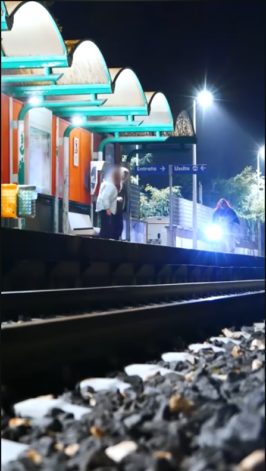
2. Reverse image search the frame and look for any links which may give information on the location
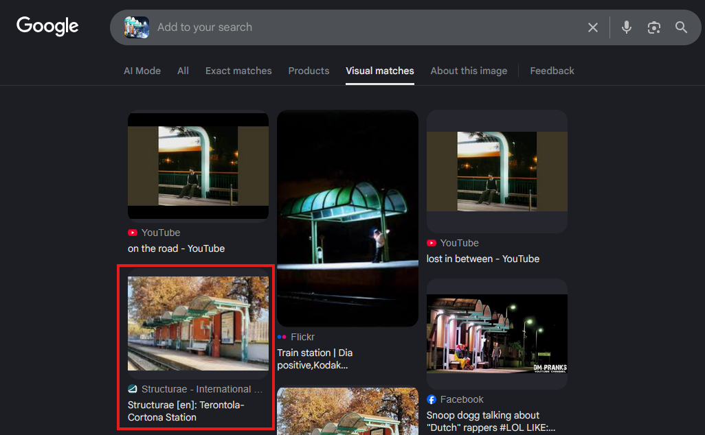
3. Search through sites found from reverse searching to find the station name
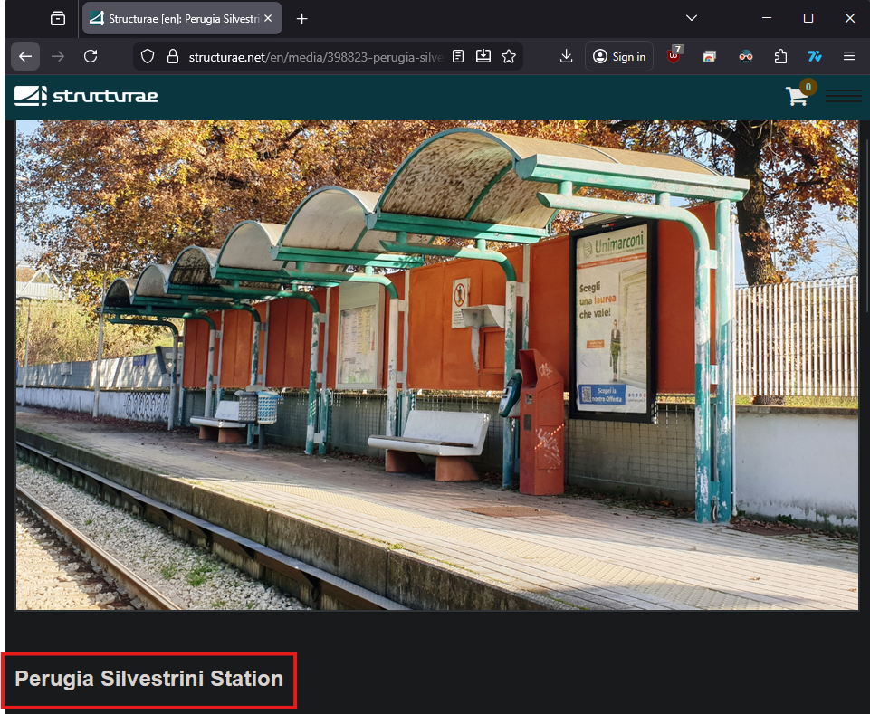
4. Confirm station details by cross referencing with other frames from the video -- in this case, by searching the assumed station name from the previous step, we can find other images that show the bridge we can see at [1:59](https://youtu.be/vaXjN3zChyE?si=Unz7sJ8c84z2sAnY&t=119) in the video
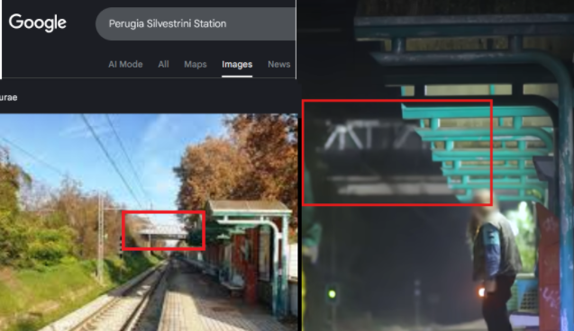



I knew this one had to be related to reverse image searching, but I just could not get an image that would take properly during the challenge. I kept finding more references to the exact same creator's videos but nothing about the station itself.

Admittedly, I got slightly frustrated with myself for not being able to find the answer to what appeared to be one of the *simplest* challenges of the competition.

As it turned out, all I needed to do was add some more context to the image - I was intentionally trying to keep the people out of it, cut off what I thought would be irrelevant at the bottom of the image, etc. when all I had to do was take a full screenshot of the video.

Lesson learned: Persistence and changing images (+ including maximum image context) when reverse searching is of great importance.



hpCTF{Perugia Silvestrini}


---

### My Identity
---
>We recorded a grave raider last night.
>
>Every information that can lead finding this person is a big help.
>
>Maybe start with the birthday?
>
>Flag Format: hpCTF{YYYYMMDD}
>
>Flag Example: hpCTF{19900615}
>
>Challenge Image: 

We've been tasked with finding the birth date of the grave raider in the image.

This one threw me for a loop at first. I overcomplicated it and went down rabbit holes that need not exist. I looked into swiss sample passports, found similar examples and even tried to figure out [how to check date of birth from a Swiss EID](https://www.ausweisapp.bund.de/en/online-identification/what-you-need). After a much needed "break" (doing other challenges) I came back to find the answer staring me right in the face.


1. Zoom in on the briefcase in the image to find a Swiss passport format
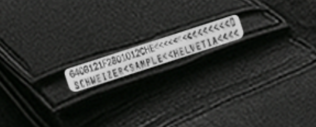
2. Read the date of birth information at the start of the passport in YYMMDD format: 640812



This one stumped me for a good while, partially due to not knowing the Swiss passport format, but how did I get to thinking that in the first place? 

Well... unfortunately, that started with me not reading the number on the photo properly. I thought it read:
- 64C0121F2801012CHE
- 64CO121F2801012CHE
- 6406121F2801012CHE

All well before I figured out that it was 640812. Up until the last one, where I realized that it may have been a birthday at the beginning of the string, I went down some deep rabbit holes of Swiss sample IDs and trying to associate this exact ID number to something I thought seemed relevant.

Lesson learned: Sometimes you just need to take a step back and reconsider simple solutions (but at the same time, getting stuck truly teaches you more than already knowing ever could).



hpCTF{19640812}


---

### My Identity - 2
---
>Great, the birthday is a good start!
>
>But tell me, belongs this passport really to the man in the image?
>
>Answer with yes or no.
>
>Flag Format: hpCTF{<yes|no>}

Now we must identify whether or not the passport in the image belongs to the *man* committing the robbery.

During my research on Swiss passport formats in the first part of this challenge, I learned that there is a gender identifying character included as well, as noted in the [MRZ TD1 travel document format](https://www.doubango.org/SDKs/mrz/docs/MRZ_formats.html).


1. This question asks us specifically if the pictured passport belongs to the **man** in the image 
2. Looking back at the passport, we can see that the character in the 8th position is an "F", which signifies that the owner of this passport is female and therefore not **his** passsport




hpCTF{no}


---

### Ghost Ship
---
>A Ghost Ship was found ashore.
>
>Can you find the IMO number of the ship.
>
>Flag Format: hpCTF{IMO_nr}
>
>Challenge Image: 

We've been tasked with finding the IMO number of the ship in the image.

This time around my searching skills didn't prove to be quite as rusty (unlike our ghost ship).


1. Quick Google reverse image search brings us to the MV Alta

2. Looking at the Wikipedia page we can find the IMO number for the ship in question



hpCTF{7432305}


---

### Ghost Ship - 2
---
>Can you also find out where the ship currently is?

Let's find out.


1. Doing some quick Google dorking with "MV Alta" and "location", we can find this resource: https://www.theultimateroadtripresource.com/location/discover-new-adventures/ghost-ship-mv-alta
2. Coordinates listed on the site are 51.8091707, -8.0657690 -- plug these into Google maps and we can see the wreckage nearby
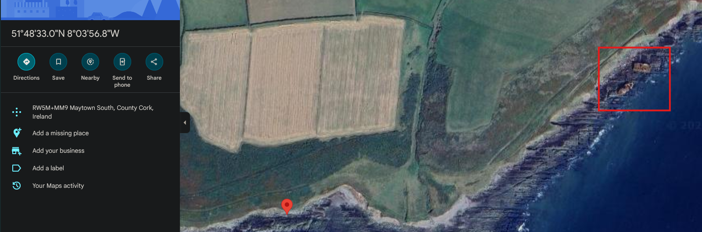
3. Grab the coordinates from the location as marked on Google maps



hpCTF{51.81125219988279, -8.056740104712809}


---

### Dude Where Was This Car
---

>You leave the tunnel where the car enters at the end of the clip: https://www.youtube.com/watch?v=j6-yVoJTCo8
>
>There is a little public rest room with a green roof at the parking lot on the left side (Year 2021).
>
>A few meters further (also on the left side) there is a sign which was build between 2008 and 2009.
>
>What does the sign say?
>
>Flag Format: hpCTF{***** ***** **}

Film locations are pretty likely to be publicly known information, but how can we locate the exact tunnel?


1. A quick Google search for "The Car 1997 film location" mentions a few spots, but the most mentioned appears to be Zion National Park, Utah
2. Google searching for "tunnels at Zion National Park" and checking out Google maps lands us at the Zion-Mount Carmel Tunnel

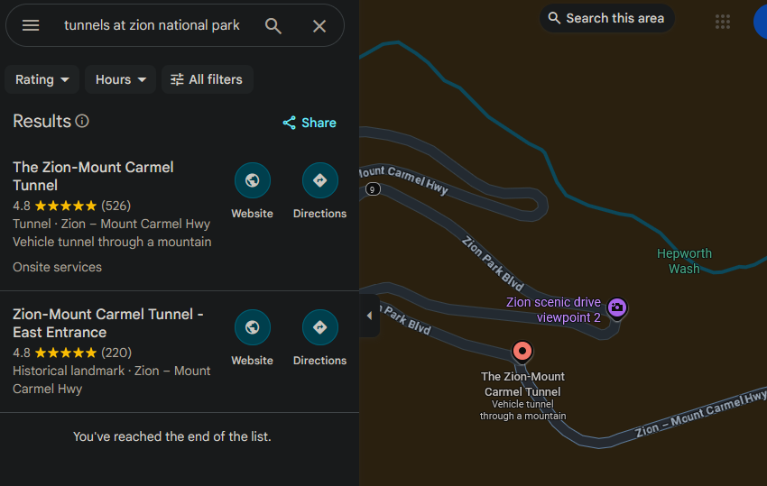

3. Going to street view on the marker conveniently places us at one of the tunnel entrances - and the images just so happen to be from April 2008 with a sign in sight

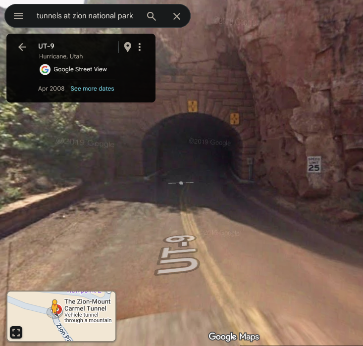



I got pretty lucky with this one as my immediate thought about Google searching the movie location produced exceptionally accurate results.

If that had not worked, however, I would have gone on to try and find a good frame of the video to screenshot and perform some reverse image searching instead.



hpCTF{SPEED LIMIT 25}


---

### Ghost in the Inbox
---
>Oh-Oh, it seems like someone tries to phish people in our name 🤨😮
>
>Can you help us figure out who really sent this email?
>
>Flag Format: hpCTF{************************}
>
>[Challenge File](OS_Discount.eml)


1. We've been given a .eml file, which is one the most used raw file formats for emails - all we need to do is be able to read it
2. Upload the given file to any eml reader, such as https://www.emlreader.com/ and look for the **From Address** to reveal the true sender




hpCTF{ctf{?@}cultoftherabbit.team}


---

### Ghost in the Inbox - 2
---
>Nice job finding the real sender of the email!
>
>Now we need more information about the domain and where it comes from. Do you know where to look?
>
>Maybe you have to dig deeper ...
>
>the flag reveals itself once you are on the right spot (in other words, its obvious when you find it)
>
>Flag Format: hpCTF{\<flag\>}

Domain related challenges often have to do with information being hidden in DNS records and this one gives us a (maybe not so) subtle hint about *digging*.


1. Look for DNS records of the sender's domain (cultoftherabbit.team) using your favourite search tool, just make sure it supports TXT records (e.g. https://dnsdumpster.com/) or use the dig utility `dig cultoftherabbit.team TXT`

DNS records can be altered or removed, if you do not find the flag in TXT records it is likely no longer being hosted as the challenge is over. They are an important place to check, but not the only place! It's worth a quick look over other DNS record types as well for this style of challenge.




I started by looking into the domain with a whois search of the domain associated to the sender: https://www.whois.com/whois/cultoftherabbit.team

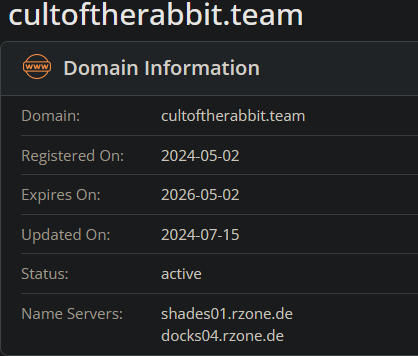

I noted that their name severs were under the .de domain, which is from Germany, and tried submitting that since the question mentioned information about **where** it comes from.

However, that isn't exactly an *obvious* flag, unlike the final solution.

At this point I was stumped for a while, but ended up moving on to try other tools, including the [whois domain tools](https://whois.domaintools.com/cultoftherabbit.team) which still landed me in Germany, but more specifically in Berlin, which I again tried using desite the fact that Berlin wouldn't be any more obvious an answer than Germany.

After some more searching I found [dnsdumpster](https://dnsdumpster.com/) which, unlike the previous tools I tried using, supports TXT records -- an important difference that resulted in finding the **significantly** more obvious flag.

Next time, maybe I should just use dig...

Lesson learned: Pay attention to the question phrasing literally, *obvious* generally cannot depend on external/unrelated knowledge.



hpCTF{TH1S_15_Y0UR_DNS_F14G}


---

### Peekabo
---
>The barcode for this parcel was placed on a really weird place...
>
>Where do you have to send this parcel so it finds its original destination?
>
>Flag Format: hpCTF{\<ZIP\>\_\<City\>\_\<Street\>\_\<Number\>}
>
>[Challenge File](weirdlylargefile.png)

Nothing jumps out in the image itself, but that doesn't mean the file isn't hiding something, especially given that intriguing file name.


1. Extract the embedded file using Binwalk or a similar tool - there are plenty of online options as well, e.g. https://www.unroll.ing/
2. We should get a .bin file after extracting, which we can change over to the .png file type in order to view as an image

3. Now that we have a barcode, we can put read it using an online tool e.g. https://online-barcode-reader.inliteresearch.com/
4. This gives us `CHE-274.572.141` which definitely does not look like an address at first glance, but a quick Google search returns results that map it to our answer




I did not manage to finish this one in time, but I researched it out after the fact.

I expected some form of file stuffing given the file name `weirdlylargefile.png` and I first tried checking it out using exiftool, which showed that there was data trailing the PNG IEND chunk.

Only issue at that point was I did not know how to properly extract it. Hexdump didn't seem to get me anywhere - the data after the IEND appeared frivilous to me. Exiftool gave me the file description as well though, which confirmed my thoughts: "hunger, ate a second file"

I ended up moving on to other challenges unsure how to extract it, but after the competition ended I read into file exfiltrating software like [binwalk](https://github.com/ReFirmLabs/binwalk) (+ online equivalents) and was able to go from there.



hpCTF{6003_Luzern_Sagenmattstrasse_7}


---

### Fake News
---
>Fake news like these spread more wildely than ever.
>
>Can you find out who was actually arrested here?
>
>Flag Format: hpCTF{**** *** \*\*\*-\*\*\*\*\*}
>
>Challenge Image: 


1. Reverse searching the right side of the image brings up articles with images of another person (https://info.51.ca/articles/1005978)

2. Translating the headline of the article above gives us the partial name "Law Wai-kwong", but this doesn't quite match the flag format
3. Google searching with the partial name returns results with the full name (our flag) and confirms the article image we found earlier




hpCTF{Ryan Law Wai-kwong}


---

### Fake News - 2
---
>Can you also find which age Ryan was when he was arrested?
>
>Flag Format: hpCTF{**}


1. Since we know his name, a simple Google search of "Ryan Law Wai-kwong age during arrest" gives us the result we're trying to find



hpCTF{46}


---

### The Distress Call
---
>Help! What's the tail number of the flight that went down?
>
>Flag Format: hpCTF{\<tailNumber\>}
>
>[Challenge File](SOS.mkv)

Mayday, Mayday!


1. Listen to the provided audio to find something identifying; since most of it is hard to hear, I went with the "Mayday 976" call
2. Google "Mayday 976" and the [first YouTube result](https://www.youtube.com/watch?v=8L5zKvAGjH0) contains the same audio, but also has the tail number
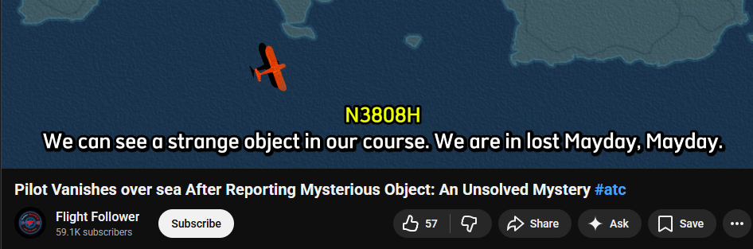



My first time getting first blood on a challenge, but I found it surprisingly simple. I think this one ended up being pretty reliant on the Google search, but that required being able to discern something useful from the very rough audio.



hpCTF{N3808H}


---

### The Distress Call - 2
---
>Can you also find the departure airport?

We've been asked to find the latitude and longitude of the departure airport for the flight we located in the previous challenge.


1. It just so happens that the video we found in the last challenge names the departure airport in the description, "took off from Los Americas International Airport in Santo Domingo, Dominican Republic"
2. Locate this airport on Google maps to get the latitude/longitude
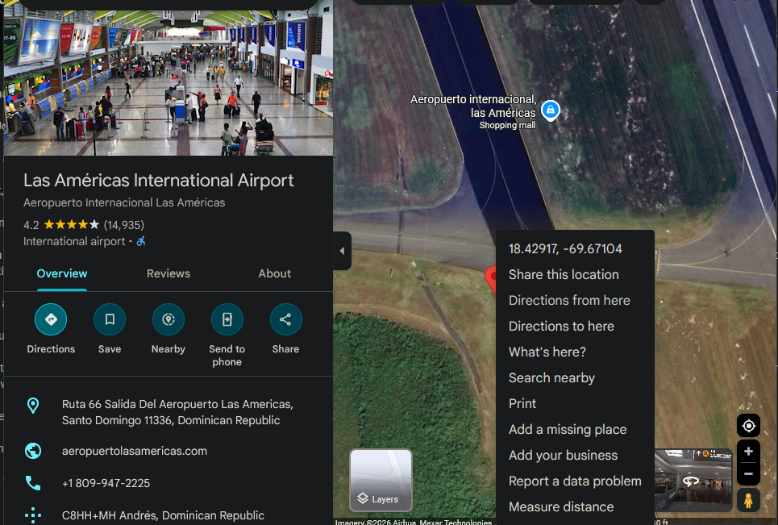



Another more "proper" way this challenge could be completed is by searching the tail number, which would let you find the [flight information](https://asn.flightsafety.org/wikibase/9407) and therefore the departure airport. 

Turns out there was an easier way out for this one though ;)



hpCTF{18.429072681791887, -69.6710365711636}


---

### The Pumpkin Ping
---
>The Pumpkin King is trying to raise his army and we need to stop him! We have some of our agents tracking his location.
>
>Here are the protocols of our secret agents so far:
>
>- Agent-Location: 2681755,1249115 Reported: 6276.932 km
>
>- Agent-Location: 2832991,1202729 Reported: 6433.205 km
>
>- Agent-Location: 2722806,1076820 Reported: 6388.037 km
>
>Can you find where the Pumpkin king is currently located?
>
>Flag Format: hpCTF{**** ** *** **** * ********}

To say I solved this one in an unintended manner would be an understatement, but at least the hosts plan on not giving such detailed flag formats next time.


1. Convert the given coordinates from Swiss LV format into GPS: https://www.swisstopo.admin.ch/en/coordinates-conversion-navref
47.387790593, 8.521410226
46.934750936, 10.499076890
45.831896296, 9.019011855
2. Check the intersections of the coordinates using them as center points of a circles with their given radius
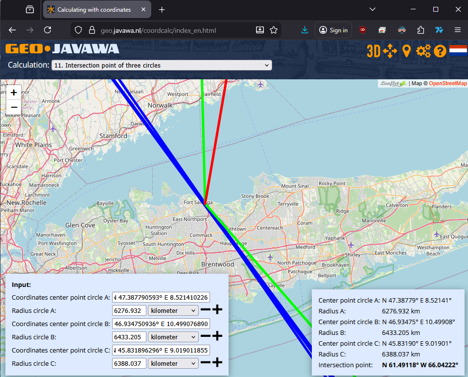
3. Search for pumpkin festivals in the area to find one that fits the flag format and we're done



I definitely did not solve this one in the intended manner, as I was completely lacking some of the knowledge required for that. I did not know these were Swiss LV coordinates that needed to be converted, nor did I know of the very useful mapping tool at https://geo.javawa.nl/coordcalc/index_en.html -- the former of which was absolutely required.

First, I made the assumption that the locations we were given were actually just coordinates but without proper formatting (mistake \#1).

Based on my incorrect assumption, I plugged the coordinates in as though they were starting points and radius coordinates for three circles to intersect using this tool (mistake \#2 - the converted coordinates would be, but the given coordinates were *not* in GPS format): https://www.mapdevelopers.com/draw-circle-tool.php

Unfortunately for me, this did appear to give what seemed like a viable result of a [near intersection](https://www.mapdevelopers.com/draw-circle-tool.php?circles=%5B%5B16093.4%2C26.8039423%2C12.4904232%2C%22%2313AA6D%22%2C%22%232BFF6B%22%2C0%5D%2C%5B6433205%2C28.329911%2C12.027291%2C%22%23091EAA%22%2C%22%232B1CFF%22%2C0%5D%2C%5B6276932%2C26.817551%2C12.491151%2C%22%2311AA3F%22%2C%22%2319FF40%22%2C0%5D%2C%5B20000%2C26.3623894%2C9.8874213%2C%22%23AA0C0C%22%2C%22%23FF1919%22%2C0%5D%2C%5B20000%2C27.228061%2C10.768201%2C%22%23AA0C0C%22%2C%22%23FF1919%22%2C0%5D%2C%5B6388037%2C26.0198133%2C10.4339911%2C%22%23AA0C0C%22%2C%22%23FF1919%22%2C0%5D%5D) just off the coast of Madagascar.

This led me down some Google searching, trying to figure out what Halloween-esque/pumpkin related festivals there are in Madigascar... which lasted quite some time and did not bring me much.

So it was back to the drawing board, but this time I took a completely different approach.

Maybe I could not solve this one in the intended manner, but I did manage to complete the challenge in time. Context clues can be extremely powerful and this case was no exception. We were given the format of the flag for this challenge in a way that told us there were exactly 6 words as well as their lengths. We also knew that we were looking for where the Pumpkin King would be trying to raise his army.

All of this context in mind, I noticed that the last 3 words seemed to fit the length of "Jack o Lanterns" \- so now we have `**** ** *** Jack o Lanterns`, which I used for some Google dorking.

I assumed the 2 and 3 letter words might be "of the", and searched "_ of the jack o lanterns" festival. Lo and behold, I found it - the RISE of the Jack o Lanterns.

And just like that, the flag was found, with none of intended method used in the slightest.



hpCTF{Rise of the Jack o Lanters}


---

### I Like Trains
---
>What classification code is written on the side of that train?
>
>Flag Format: hpCTF{* *** * ****}
>
>Challenge Image:


1. Google reverse image searching the provided image brings us to a YouTube channel with this video: https://www.youtube.com/watch?v=kqp9uFIQtMM
2. Video description mentions the type of train, "1910 rotary snowplow", which we can use for some Google to find the classification code



hpCTF{X Rot D 9213}


---

### Friday 13
---
>What a legend in the world of horror movies.
>
>Are you able to find his phone number?
>
>Flag Format: hpCTF{+* ***-***-****}

Unfortunately I will not be including the image nor the flag for this challenge, as I would like to avoid including PII for real people in my writeups.


1. Reverse image search the provided challenge image to figure out who we are looking for
2. Search the challenge target's name in a data aggregator to find their phone number


---

### Friday 14
---
> Can you also find his email (related to his role)?
>
> Flag Format: hpCTF{\<email\>}

Once again I will not be including the result of this challenge, but it was simply searching through data for the correct email which was *very clearly* related to the role we previously discovered.

---

### The Misunderstanding
---
>Listen closely, the place you're looking for will be in German.
>
>Flag Format: hpCTF{**** ***********}
>
>[Challenge File](listen.mkv)

Another challenge that I was unfortunately not able to solve in time, sometimes previous failures can misguide our future actions...


1. Exfiltrate data from the included audio file and analyze it (`exiftool listen.mkv`), we find that there are two audio tracks
2. Check both audio tracks separately (you can use mpv or other tools like VLC for this purpose), track 2 seems to contain morse code
3. Translating the coordinates from morse code, we find `47.3498256, 8.4896817`
4. Punch in the coordinates on Google maps to find our location



One of my more frustraing failures of this CTF, I unfortunately burned myself on a previous challenge failure and completely overlooked one of the more obvious methods to try.

First thing I did was listen to the audio - no issue so far, but it definitely sounds familiar. I looked up some what I could hear in the audio and found that it was from the *War of the Worlds* audio, but what could that have to do with the clue?

At this point, since the clue said *listen closely*, I decided to try taking that literally and listening for any words that could be interpreted in German to have a different meaning. No luck there.

Next I tried translating the script to German, maybe something would translate to the place we are looking for? Once again, no luck.

I went over this quite a while, digging through some more rabbit holes, but eventually decided to shelve it.

Unfortunately, earlier on in the CTF, I tried using exfiltration on the PNG for Peekabo to no avail, which I think is what led me to not even consider doing it on this seemingly clearly unrelated audio file (with some odd noise in the background).

Lesson learned: Each challenge is separate, consider them as such and do not let previous failures inhibit ideas for future challenges.



hpCTF{Mars Planetenweg}


---

### Blair Witch Resident
---
>Where was this picture taken?
>
>Challenge Image: 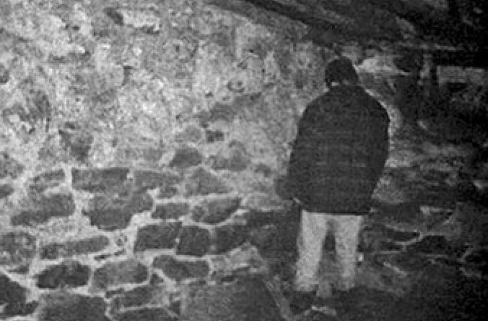

We can start from a couple different places here, but given an image a reverse search never hurts.


1. Reverse search the given image to find that it's from the Blair Witch Project (alternatively, make this assumption from the challenge name)
2. Google dork for the house in the Blair Witch Project to find the (former) location of the home, as it has since been demolished
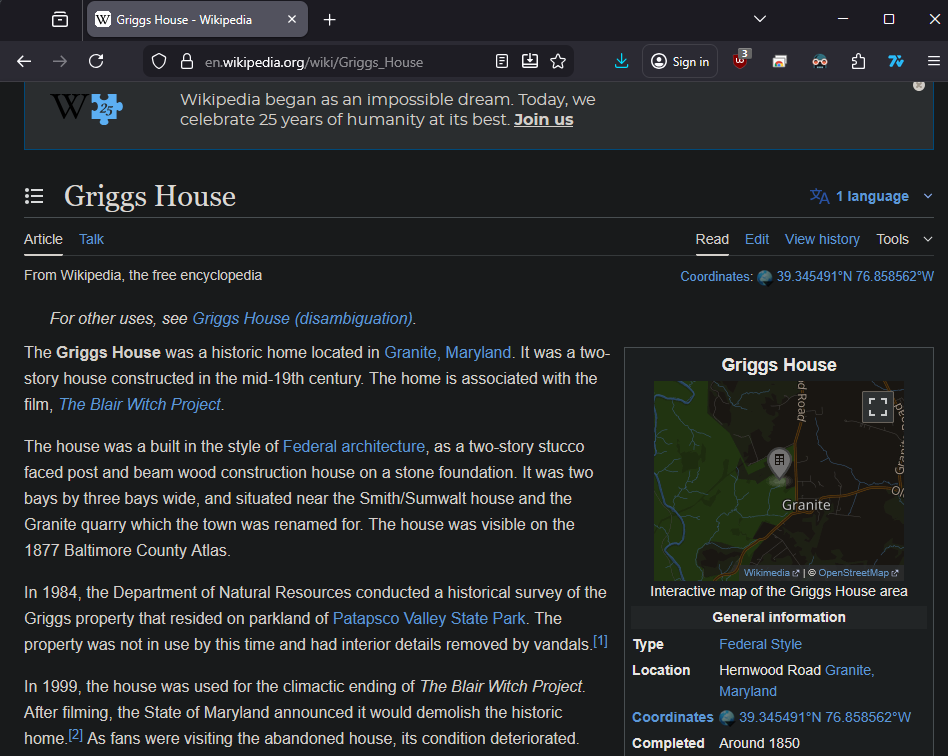



hpCTF{39.34549341656919, -76.85856241950255}


---

### Three Word Nightmare
---
>Where still today pure evil is being kept and controlled for years, the nightmare started ages ago.
>
>When did the most famous resident of this place started spreading its nightmares? And who was the first victim?
>
>Flag Format: hpCTF{YYYY_\<name\>}
>
>[Challenge File](3W.mp3)

Any challenge referencing three words gives us some initial direction that we can explore, but let's see how we can use that to figure out our famous resident and the victim in question.


1. Listen to the attached audio file, which seems to say three words: "Direction, Unwraps, Blacksmith"
2. Given three words and the need to find a location, we can try plugging them into https://what3words.com
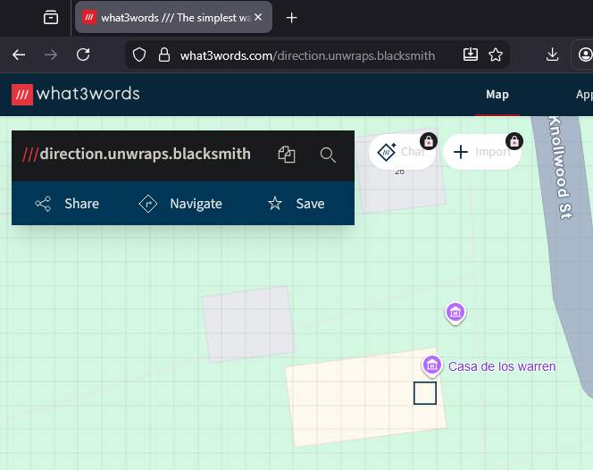
3. We've landed at the Casa de los Warren, aka the Warren House/Warren Occult Museum, which is most famously the residence of the Annabelle doll, so a quick Google serach of the first victim of the Annabelle doll will give us our flag



Another fun challenge, and much easier if you notice that there is an attachment. I initially went down a rabbit hole of trying to riddle out the clue and thought:
1. "Spreading nightmares" and "pure evil" \-\> Nightmare on Elm Street
2. First victim in Nightmare on Elm Street \-\> Tiny Gray in 1981

Unfortunately, that was *completely* off base, turns out I started thinking like we were doing an escape room (though, in some regards, I suppose CTFs are similar).

Lesson learned: make sure to read the entire challenge and double check for any attached resources.



hpCTF{1970_Donna}


---

### Twin Sister
---
> A ship went down in early 1900, killing 1500. It had two siblings, and one had a tragic accident as well. Can you locate where the sister ship rests today?

We're being asked to find where the sister ship of a ship with the given details lies today, let's see how we can do it.


1. Based on the details we were given, the ship that went down sure soudns like the Titanic, but since we're looking for the sister ship let's confirm with a search
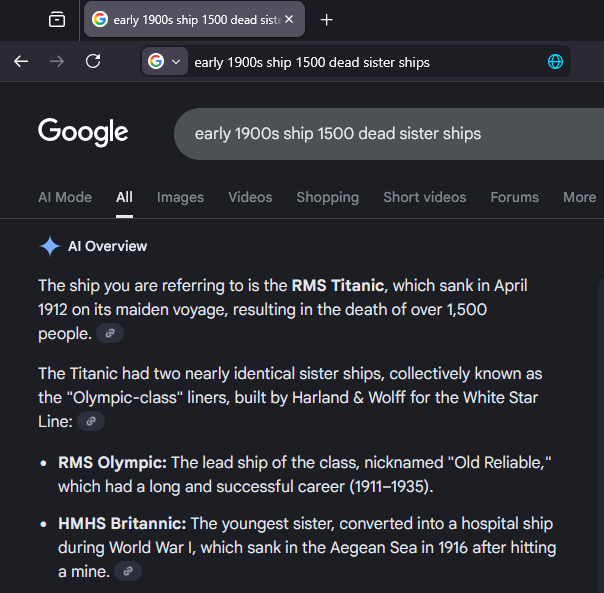
2. It appears we were correct and, according to our search, the sister ship that went down is the HMHS Britannic - now we can use Google maps to find where the wreckage is located




hpCTF{37.70231908754482, 24.283473499999996}


---

### Follow The Money
---
>a11ab03eeb08f4914bc6d7421dca96ebd6c96ff1c9b3e028d3a268cf44c21aff 
>
>Flag Format: {\<programming_language\>}
>
>Challenge Image: 
>

Here's to Google lens for easy (relatively good) text translation.


1. Translate the text using your preferred method to find that it says something about a donation being made to a software development studio
2. Knowing this, we can make the assumption that the challenge description string is a bitcoin transaction hash, which we can search on blockchain to find one [transaction](https://www.blockchain.com/explorer/transactions/btc/a11ab03eeb08f4914bc6d7421dca96ebd6c96ff1c9b3e028d3a268cf44c21aff)
3. Funds have been sent to two accounts: `3EYyfuqH7zMPUJYymbNsLjYBG2pxGjgjDe` and `18kj9UWRZC9YxZMoN2iz2A8Xmwqxxdyp8X`
4. Google searching both of the addresses doesn't seem to return much for the first one, but the second one appears to have a GitHub account associated with it:
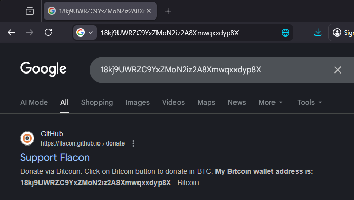
5. We can now check the associated GitHub repository (for the "flacon" app) to find their least used language:
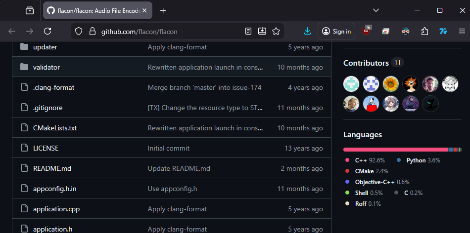



I enjoyed this challenge - it introduced me to some concepts in blockchain transaction history searching and was quite fun to solve on the spot.



hpCTF{Roff}


---

### The Halloween Party
---
>There is a flag in this room. I guess you know what to do...
>
>Flag Format: htpCTF{\<flag\>}
>
>Challenge Image: 

Now where could that flag be hiding...?


1. Reconstruct the QR code in the image so that a scanner can read it (there are multiple methods of doing this)
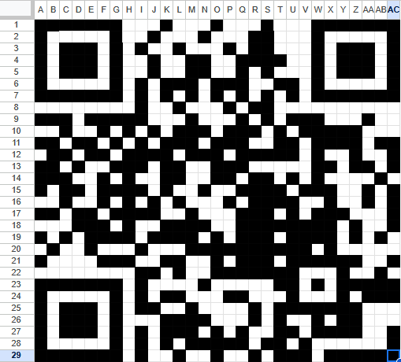
2. Scan the QR code to find the flag



While straightforward on the surface, this challenge ended up proving to be rather time consuming. The challenge is exactly as it seems: figure out a way to get the QR code in the image to scan. How can we go about that though?

At first, I tried editing the image - removing the red background, drawing the missing corner in, even doing some rotation, but I was unable to get it to scan (some were able to manage this, however).

So, after quite some time spent trying to get the image to take from various different rotations/methods of drawing in the corner, I decided to reconstruct the QR code (as many others did), however I used what appeared to have been a rather unconventional method in Excel.

I tried some of the QR code painting tools online, but found most of them annoying to use at best, so instead I did some good ole conditional formatting with nothing but 1s and blank cells.

It worked, for what it's worth.



hpCTF{051N7_5W17Z3RL4ND_H4LL0W33N_CTF}


---

## Final Thoughts
---
At the end of it all I placed at rank 23 out of ~800+ participants. I was able to maintain a top 10 position for the majority of the first ~16 hours -- not bad for a first timer! I believe I ended up being tied for first place in terms of solo players, but I'm sure many more experienced solos could have done much better than I did. Next time, I think I'll try to find a teammate. There are so many moments where having another perspective is truly invaluable.

Overall I really enjoyed this as my first foray into OSINT CTFs. Huge thanks to the team over at OSINT Switzerland for hosting and the members of their Discord community for being so welcoming and friendly - this is a truly supportive group that anyone with an interest can find their place in, no matter how (in)experienced.

Thank you for reading and have a great rest of your day/night!

-ic3sec

---