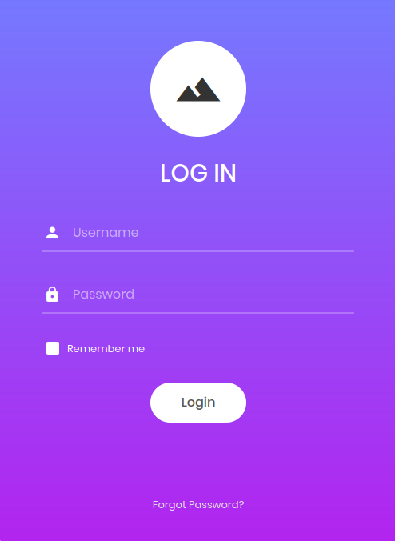

## Overview
---
Part of the "starting point"  boxes on HTB, Appointment has a set of tasks with questions that provide a framework to walk through the machine. Appointment focuses on SQL (specifically, MySQL) and guides the user towards writing their first SQL injection attack. As this machine is part of the “starting point” category, many of the tasks are fundamental knowledge questions - I highly recommend researching them a bit if you do not know the answer instead of copy/pasting.

|                  |               |
| ---------------- | ------------- |
| **Release Date** | 06 Oct, 2021  |
| **Difficulty**   | Very Easy     |
| **OS**           | Linux         |
| **Created By**   | [ch4p](https://app.hackthebox.com/users/1) |

---

## Tasks

---

### Task 1
---

What does the acronym SQL stand for?



Structured Query Language


---

### Task 2
---

What is one of the most common type of SQL vulnerabilities?


While there are others, one type of attack is definitely most prevalent for SQL - so much so that a search of "sql vulnerabilities" should return this as the top result.


SQL Injection


---

### Task 3
---

This task number was skipped over when I completed the box, leaving this here for continuity of task numbers.

---

### Task 4
---

What is the 2021 OWASP Top 10 classification for this vulnerability?


OWASP's 2021 top 10 can be found [here](https://owasp.org/Top10/2021/).


A03:2021-Injection


---

### Task 5
---

What does Nmap report as the service and version that are running on port 80 of the target?


Given the port here a targetted nmap scan can be run for efficiency:
```bash
[ice@parrot]─[~/Appointment]$ nmap -sV -p 80 10.129.132.222
Starting Nmap 7.94SVN ( https://nmap.org ) at 2026-07-09 01:58 EDT
Nmap scan report for 10.129.132.222
Host is up (0.074s latency).

PORT   STATE SERVICE VERSION
80/tcp open  http    Apache httpd 2.4.38 ((Debian))

Service detection performed. Please report any incorrect results at https://nmap.org/submit/ .
Nmap done: 1 IP address (1 host up) scanned in 7.34 seconds
```


Apache httpd 2.4.38 ((Debian))


---

### Task 6
---

What is the standard port used for the HTTPS protocol?



443


---

### Task 7
---

What is a folder called in web-application terminology?



Directory


---

### Task 8
---

What is the HTTP response code that is returned for `Not Found` errors?


HTTP codes and their descriptions can be found [here](https://developer.mozilla.org/en-US/docs/Web/HTTP/Reference/Status).


404


---

### Task 9
---

Gobuster is one tool used to brute force directories on a webserver. What switch do we use with Gobuster to specify we're looking to discover directories, and not subdomains?


gobuster's mode flags can be found on the [man page](https://manpages.debian.org/testing/gobuster/gobuster.1.en.html).


dir


---

### Task 10
---

What single character can be used to comment out the rest of a line in MySQL?



`#`


---

### Task 11
---

If user input is not handled carefully, it could be interpreted as a comment. Use a comment to login as admin without knowing the password. What is the first word on the webpage returned?


I know there is an Apache server running on port 80 from the earlier nmap scan, here's what it looks like if I navigate to the page in a browser:


Since the question mentions logging in as admin without knowing the password and this module is about SQL injection, it's safe to assume where this is going next. Let's take a look at how the SQL query in the background may be constructed. Let's say, for a successful login, the server needs to find a result in the database that matches both the username and password input. That query could look something like this:

```mysql {title="MySQL"}
SELECT * FROM users WHERE username = '<input_username>' AND password = '<input_password>' AND <other conditions>
```

Assuming that our raw input is being taken for `<input_username>` and `input_password`, we can start to see where this might go wrong. As mentioned in the previous task, `#` comments anything after it on a line in MySQL. SQL can also evaluate equations, e.g. `1=1` which always evaluates to true.

Combining these concepts, we can try to construct a simple SQL injection attack:

**Username:** `admin`

**Password:** `' OR 1=1 #`

Again, assuming raw input and the above query example, the backend would now evaluate the following query:
```mysql {title="MySQL"}
SELECT * FROM users WHERE username = 'admin' AND password = '' OR 1=1 #AND <other conditions>
```

And that query would select the user with username = `admin` and *any* password (since we are checking the condition `OR 1=1`, which is always true), and if there were any other conditional checks as part of the query coming after that, they would be ignored with the `#` commenting out the rest of the line.

Trying it out on the webpage brings up a new page which contains the answer to this task (and the flag)!


Congratulations


---

### Submit Single Flag
---

Flag is on the same page that was reached in the last task.


e3d0796d002a446c0e622226f42e9672


---

## Closing Thoughts
---
Appointment is another great introductory machine for a very core fundamental in penetration testing: SQL injection. I feel as though this provided a solid guide to steer the user's hand in the right direction while not giving away the answer completely - some research into the basics of SQL injection (or SQL in general) needs to be done to understand the construction of the injection and this is just the tip of the iceberg.

Although SQL injections, at least in the form presented in this module, are *significantly* less common due to modern advancements, they are still possible to run across -- or, in other cases, there are some much more contrived forms of SQL injection that attempt to abuse the solutions (e.g. input sanitation) put in place to prevent just that.

There are numerous resources on SQL injection but if you're interested in more the [OWASP SQL injection page](https://owasp.org/www-community/attacks/SQL_Injection) is a great place to start.

---